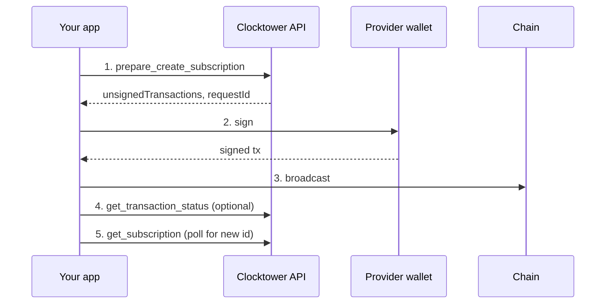

# Create Subscription Workflow

## Goal

A **provider** publishes a new subscription on-chain so others can subscribe to it.

## Who is involved

| Role | What they do |
|------|----------------|
| **Provider** | The wallet address passed as `from` — creates and owns the subscription |
| **Your app** | Builds the subscription params and requests unsigned `createSubscription` calldata |
| **Clocktower API** | Simulates and returns unsigned transactions |
| **Wallet** | Signs and broadcasts to the selected chain (REST `?chainId=`; MCP always Base) |

## Steps

1. **Prepare create** — send amount, token, frequency, due day, and metadata; receive unsigned `createSubscription` calldata.
2. **Sign** — provider wallet signs the transaction.
3. **Broadcast** — your app sends it to the chain in `unsignedTransactions[].chainId` (MCP: Base mainnet).
4. **Confirm** (optional) — poll transaction status.
5. **Fetch new ID** — after mining, read the subscription by ID or poll until it appears on-chain.

## Flow diagram



## Calls by surface

| Step | REST | MCP tool | SDK |
|------|------|----------|-----|
| 1. Prepare | `POST /prepare/create_subscription` | `prepare_create_subscription` | `createSubscription()` |
| 2–3. Sign & broadcast | Your wallet + RPC | Same | `walletClient` via viem |
| 5. Fetch ID | `GET /subscriptions/:id` or search | `get_subscription` | `waitForSubscription()` |

## Example request body

```json
{
  "from": "0xProviderAddress",
  "amount": "10",
  "token": "0x...",
  "details": { "url": "https://example.com/", "description": "Premium" },
  "frequency": 1,
  "dueDay": 15
}
```

<IfFeature name="sdk">
The SDK accepts human-readable `amount` strings and `Frequency` enum values. See [Due day ranges](/docs/developers/SDK/reads-and-writes) for valid `dueDay` per frequency.
</IfFeature>

On REST, pass `?chainId=` on prepare and on the follow-up `GET /subscriptions/:id` so you stay on the same chain. MCP create is Base-only.