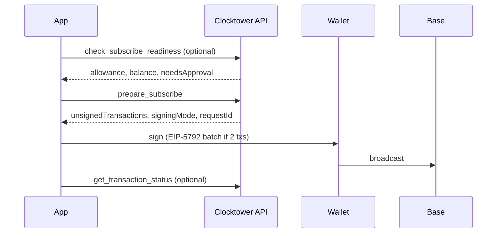

# Subscribe Workflow

An account starts paying into an existing subscription.

**Actor:** Subscriber wallet (`from`).

## By surface

| Step | REST | MCP | SDK |
|------|------|-----|-----|
| Readiness | `POST /api/check_subscribe_readiness` | `check_subscribe_readiness` | Preflight in `subscribe()` |
| Prepare | `POST /api/prepare/subscribe` | `prepare_subscribe` | `subscribeWithApproval()` |
| Sign | Wallet signs `unsignedTransactions` | Same | `walletClient` signs |
| Broadcast | Client broadcasts to Base | Same | SDK broadcasts via viem |
| Status | `POST /api/transactions/status` | `get_transaction_status` | `waitForReceipt: true` |

## EIP-5792 batching

When ERC-20 allowance is insufficient, prepare returns `signingMode: "eip5792"` with approve + subscribe in one batch.

## Readiness-only shortcut

Pass `readinessOnly: true` to `prepare_subscribe` / `POST /api/prepare/subscribe` to validate without generating unsigned transactions.