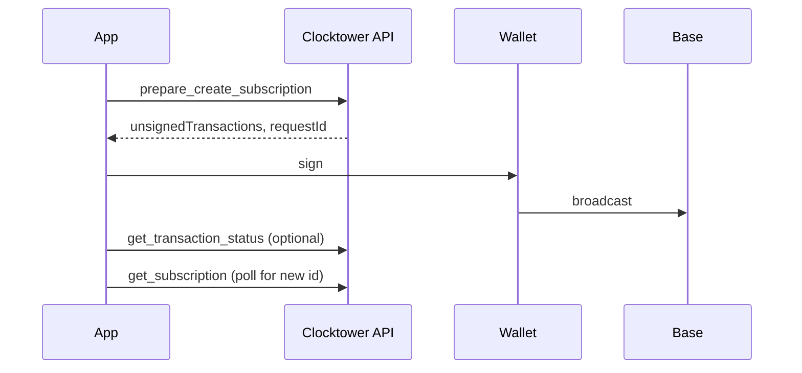

# Create Subscription Workflow

A provider creates a new subscription on-chain.

**Actor:** Provider wallet (`from`).



## By surface

| Step | REST | MCP | SDK |
|------|------|-----|-----|
| Prepare | `POST /api/prepare/create_subscription` | `prepare_create_subscription` | `createSubscription()` |
| Sign & broadcast | Wallet | Wallet | `walletClient` via viem |
| Poll for ID | `GET /api/subscriptions/:id` or search | `get_subscription` | `waitForSubscription()` |

## Request body

```json
{
  "from": "0xProviderAddress",
  "subscription": {
    "amount": "10",
    "token": "0x...",
    "details": { "url": "https://example.com/", "description": "Premium" },
    "frequency": 1,
    "dueDay": 15
  }
}
```

SDK accepts human-readable `amount` strings and `Frequency` enum values.

See [Due day ranges](/docs/developers/SDK/reads-and-writes) for valid `dueDay` per frequency.