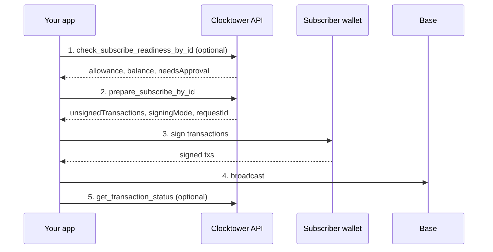

# Subscribe Workflow

## Goal

A **subscriber** starts paying into an **existing** subscription created by a provider.

## Who is involved

| Role | What they do |
|------|----------------|
| **Subscriber** | The wallet address passed as `from` — must hold enough ERC-20 and approve the Clocktower contract |
| **Your app** | Calls the API/MCP or SDK, then asks the wallet to sign |
| **Clocktower API** | Validates readiness and returns unsigned transactions (never broadcasts for you) |
| **Wallet** | Signs transactions; your app broadcasts them to Base |

:::info SDK path
The SDK skips the prepare step and talks to the chain directly via viem when you call `subscribeWithApproval()`.
:::

## Steps

1. **Check readiness** (optional) — confirm allowance, balance, and protocol rules before preparing a transaction.
2. **Prepare subscribe** — request unsigned `subscribe` calldata (and an `approve` tx if allowance is low).
3. **Sign** — subscriber wallet signs `unsignedTransactions`. If two txs are needed, signing mode is `eip5792` (approve + subscribe batch).
4. **Broadcast** — your app sends the signed transaction(s) to Base mainnet.
5. **Confirm** (optional) — poll transaction status or wait for an on-chain receipt.

The server never holds your keys and never relays signed transactions.

## Flow diagram

## Calls by surface

| Step | REST | MCP tool | SDK |
|------|------|----------|-----|
| 1. Readiness | `POST /check_subscribe_readiness_by_id` (**preferred**) or object form | `check_subscribe_readiness_by_id` | Built into `subscribe()` preflight |
| 2. Prepare | `POST /prepare/subscribe_by_id` (**preferred**) or object form | `prepare_subscribe_by_id` | `subscribeWithApproval()` / `subscribeById` |
| 3–4. Sign & broadcast | Your wallet + RPC | Same | `walletClient` via viem |
| 5. Confirm | `POST /transactions/status` | `get_transaction_status` | `waitForReceipt: true` |

By-id routes need only `from` + subscription `id` (amount/token/provider loaded on-chain). Object form remains for callers that already hold a full subscription object.

## Tips

**EIP-5792 batching** — when ERC-20 allowance is insufficient, prepare returns `signingMode: "eip5792"` with approve + subscribe in one batch (amount-scoped approve by default; `infiniteApproval: true` for max).

**Readiness-only** — pass `readinessOnly: true` on prepare to validate without generating unsigned transactions.

**REST prepare limits** — free and developer keys have tight prepare/readiness caps. For production subscribe volume, prefer the SDK with your own RPC.