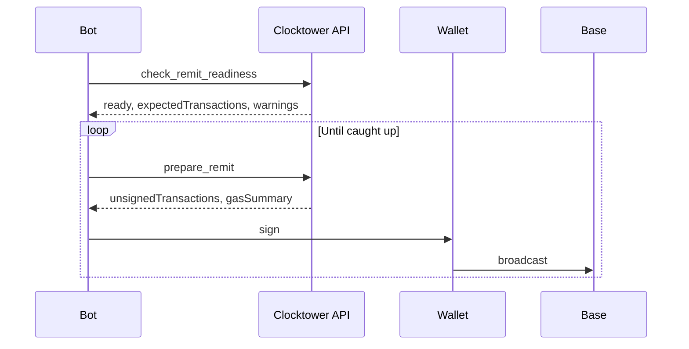

# Remit Caller Workflow

A permissionless caller executes `remit()` to process due subscription payments and earn caller fees.

**Actor:** Caller wallet.

## By surface

| Step | REST | MCP | SDK |
|------|------|-----|-----|
| Readiness | `POST /api/check_remit_readiness` | `check_remit_readiness` | `checkRemitReadiness()` |
| Prepare | `POST /api/prepare/remit` | `prepare_remit` | `remit()` |
| Loop | Repeat until caught up | Same | `runRemitUntilCaughtUp()` |

## Notes

- One `remit()` clears at most `maxRemits` payments per transaction
- Caller pays gas (unlike the operator cron bot)
- Large backlogs may need multiple broadcasts — check `gasSummary.backlogMultiplier`
- Use `get_subscriptions_due` / `getSubscriptionsDue()` for lightweight single-day reads