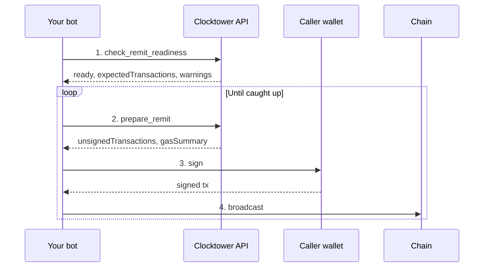

# Remit Caller Workflow

## Goal

A **caller** runs the permissionless `remit()` function to process due subscription payments and earn caller fees in the subscription's ERC-20 token.

## Who is involved

| Role | What they do |
|------|----------------|
| **Caller** | Any wallet — pays gas and receives caller fee payouts |
| **Your bot** | Checks readiness, prepares remit txs, signs, and broadcasts in a loop |
| **Clocktower API** | Scans the due queue and returns unsigned `remit()` calldata |

## Steps

1. **Check remit readiness** — scan how many subscriptions are due and whether `remit()` can run now.
2. **Prepare remit** — get unsigned `remit()` calldata plus gas estimates.
3. **Sign & broadcast** — caller wallet signs and your bot sends to the chain in `unsignedTransactions[].chainId` (MCP: Base).
4. **Repeat** — one `remit()` clears at most `maxRemits` payments; loop until the backlog is caught up.

The caller pays gas for every broadcast (unlike the protocol's operator cron).

## Flow diagram

## Calls by surface

| Step | REST | MCP tool | SDK |
|------|------|----------|-----|
| 1. Readiness | `POST /check_remit_readiness` | `check_remit_readiness` | `checkRemitReadiness()` |
| 2. Prepare | `POST /prepare/remit` | `prepare_remit` | `remit()` |
| 3–4. Loop | Repeat until caught up | Same | `runRemitUntilCaughtUp()` |

## Tips

- Large backlogs may need multiple broadcasts — check `gasSummary.backlogMultiplier` in prepare responses.
- Use `get_subscriptions_due` / `getSubscriptionsDue()` for a lightweight single-day read without preparing a transaction.
- On REST, pass `?chainId=` so readiness, prepare, and status poll the same chain. MCP remit is Base-only.