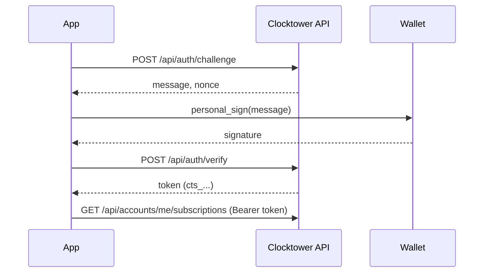

# Builder Auth Workflow

Builder tier unlocks higher REST rate limits and `:me` routes scoped to your wallet.

**Prerequisites:**

1. An **ACTIVE** on-chain subscription to the server's Builder entitlement subscription (`BUILDER_SUB_ID`)
2. A wallet to sign the SIWE message



## Steps

### 1. Subscribe to Builder entitlement

Subscribe to the Clocktower Builder entitlement subscription on Base. The subscription ID is configured server-side as `BUILDER_SUB_ID`.

### 2. Request challenge

```bash
curl -s -X POST http://127.0.0.1:8787/api/auth/challenge \
  -H "Content-Type: application/json" \
  -d '{ "address": "0xYourAddress" }'
```

### 3. Sign SIWE message

Use `personal_sign` in your wallet on the returned `message`.

### 4. Verify and cache token

```bash
curl -s -X POST http://127.0.0.1:8787/api/auth/verify \
  -H "Content-Type: application/json" \
  -d '{ "message": "...", "signature": "0x..." }'
```

The session token (`cts_…`) is cached client-side — it is not a pre-shared API key.

### 5. Use Builder routes

```bash
curl -s http://127.0.0.1:8787/api/accounts/me/subscriptions \
  -H "Authorization: Bearer cts_..."
```

## CLI helper

```bash
npm start rest auth login
npm start rest auth status
npm start rest get /accounts/me/subscriptions
```

See [Authentication](/docs/developers/REST%20API/authentication) and [Rate limits](/docs/developers/REST%20API/rate-limits).