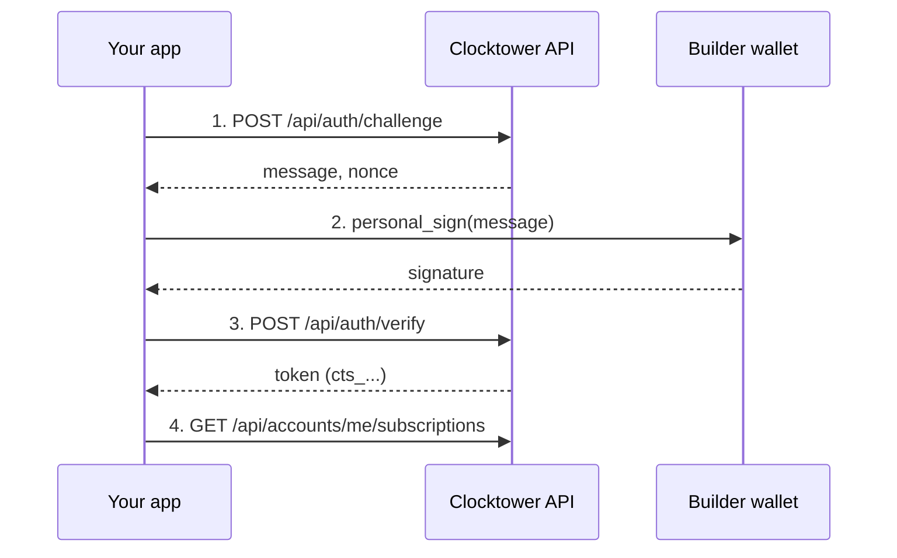

# Builder Auth Workflow

## Goal

Obtain a **Builder session** so your REST calls get higher rate limits and access to `:me` routes scoped to your wallet.

## Who is involved

| Role | What they do |
|------|----------------|
| **Builder** | A wallet with an active on-chain subscription to the Builder entitlement (`BUILDER_SUB_ID`) |
| **Your app** | Requests a SIWE challenge, asks the wallet to sign, exchanges the signature for a session token |
| **Clocktower API** | Issues a `cts_…` bearer token after verifying the signature and entitlement |

## Prerequisites

1. An **ACTIVE** on-chain subscription to the server's Builder entitlement subscription.
2. A wallet to sign the SIWE message.

## Steps

1. **Request challenge** — `POST /api/auth/challenge` with your address; receive a message and nonce.
2. **Sign** — wallet `personal_sign` on the returned message.
3. **Verify** — `POST /api/auth/verify` with message + signature; receive `cts_…` token.
4. **Use Builder routes** — send `Authorization: Bearer cts_…` on subsequent `/api` calls (e.g. `/api/accounts/me/subscriptions`).

The session token is not a pre-shared API key — it is obtained via SIWE and cached client-side.

## Flow diagram



## Example commands

**Challenge:**

```bash
curl -s -X POST http://127.0.0.1:8787/api/auth/challenge \
  -H "Content-Type: application/json" \
  -d '{ "address": "0xYourAddress" }'
```

**Verify:**

```bash
curl -s -X POST http://127.0.0.1:8787/api/auth/verify \
  -H "Content-Type: application/json" \
  -d '{ "message": "...", "signature": "0x..." }'
```

**Authenticated request:**

```bash
curl -s http://127.0.0.1:8787/api/accounts/me/subscriptions \
  -H "Authorization: Bearer cts_..."
```

## CLI helper

```bash
npm start rest auth login
npm start rest auth status
npm start rest get /accounts/me/subscriptions
```

See [Authentication](/docs/developers/REST%20API/authentication) and [Rate limits](/docs/developers/REST%20API/rate-limits).