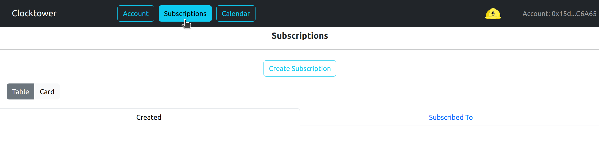
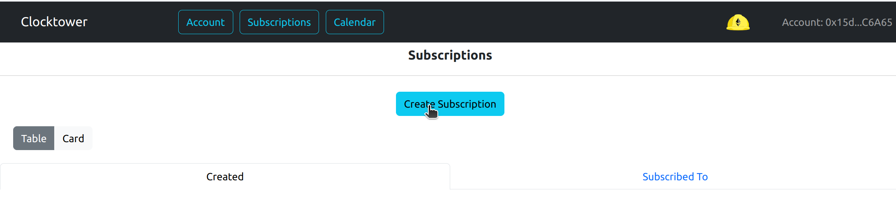
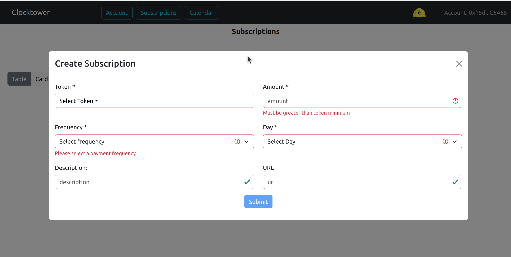
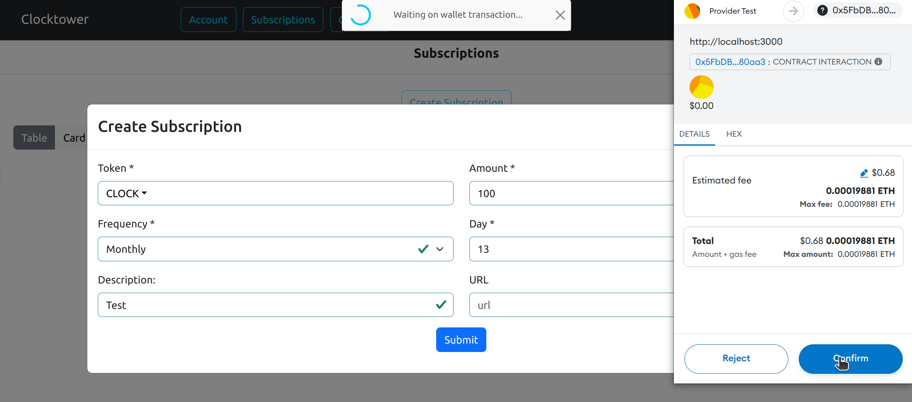
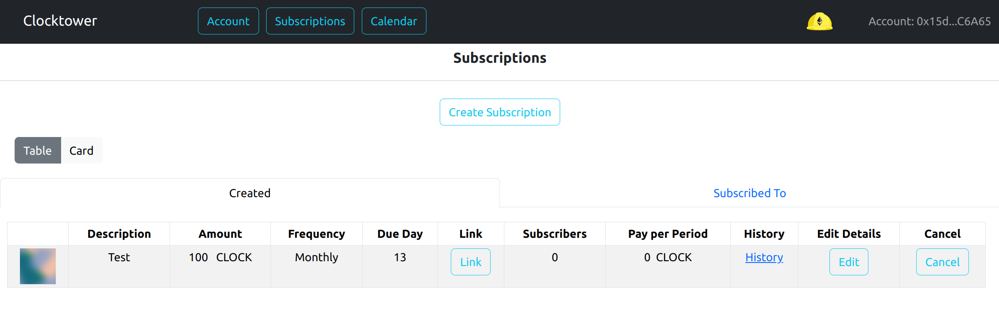
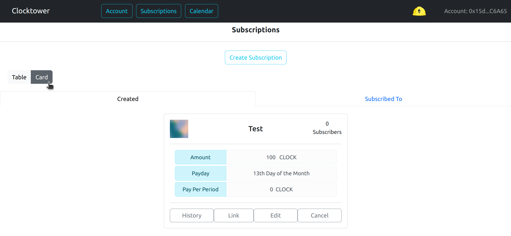

# Create a subscription

### Required Parameters

All subscriptions require the following information to be entered:

| Parameter | Description |
|---|---|
| Token | ERC20 token you wish to paid in. From pre-defined list |
| Amount | Amount of tokens you wish to be paid per period |
| Frequency | Frequency of payment. Currently either weekly, daily, quarterly or yearly |
| DueDay | Payday in [range](../../../contracts/01-Subscribe/01-subscribe_tech_reference.mdx#allowed-time-ranges) determined by frequency | 

### Optional Parameters

| Parameter | Description | |
|---|---|---|
| Description | Brief title of Subscription | RECOMMENDED |
| URL | URL link to more info on subscription | |

### Steps to create a subscription

1. Click on the Subscriptions button in the top menu 

2. Click on the Create Subscription button

3. Fill out the form making sure to complete the required fields

4. Complete the transaction in your wallet

5. The new subscription will display below either in table of card formatting

