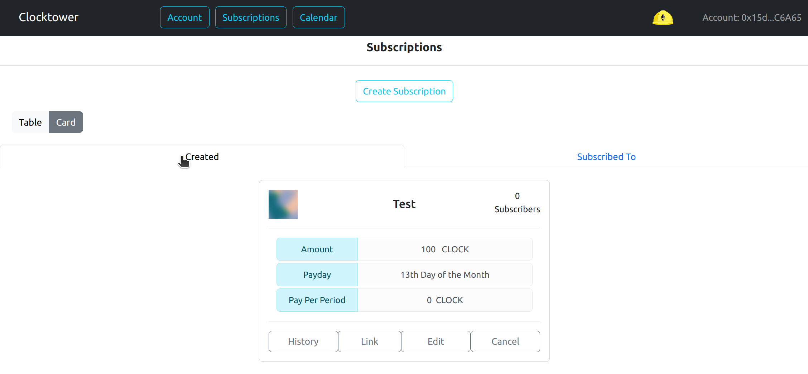
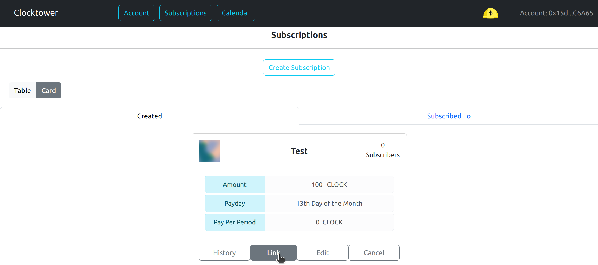
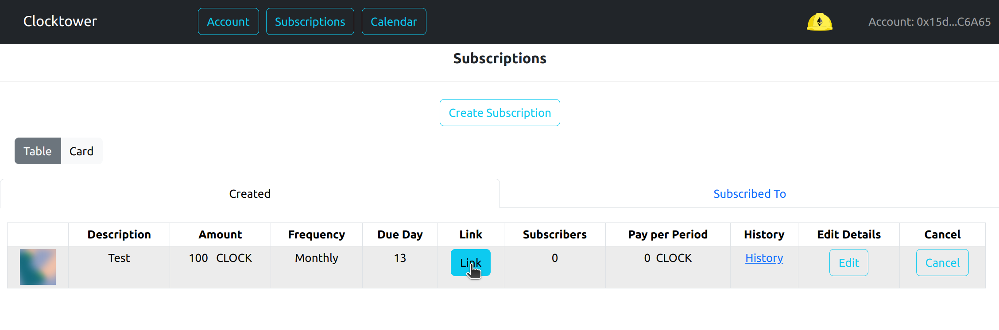
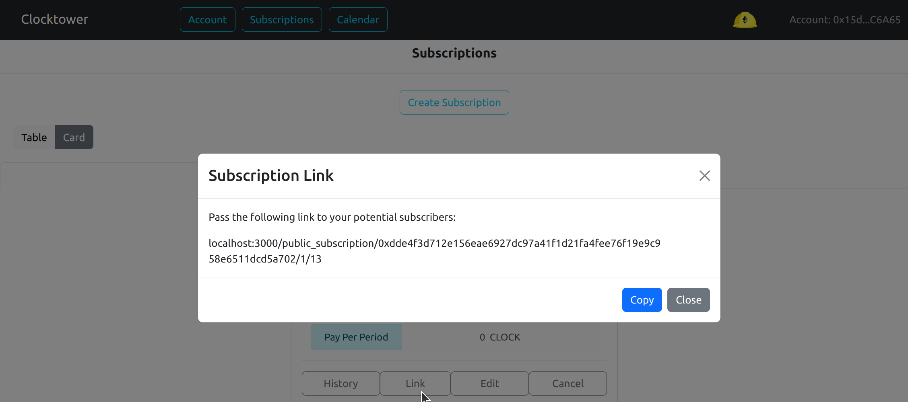

# Create a public link

The following shows how a Provider can create a link which they can share with prospective subscribers

### Steps to creating a public link

1. Make sure the "Created" tab is selected

2. Click the "Link" button the subscription you want to share

3. Copy the link and distribute it to potential subscribers

