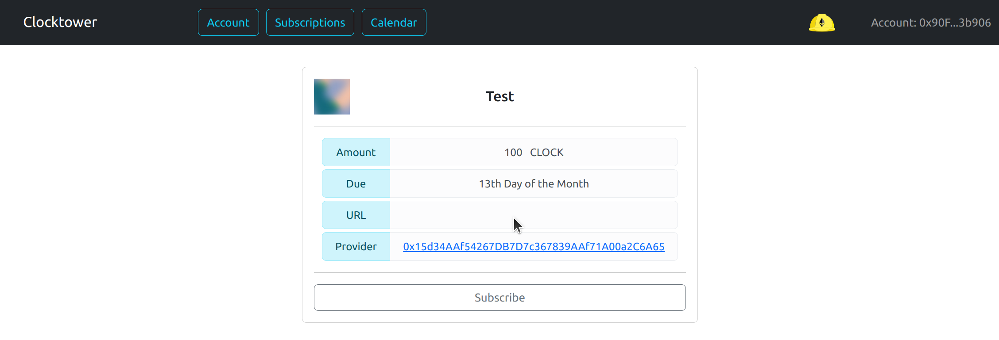
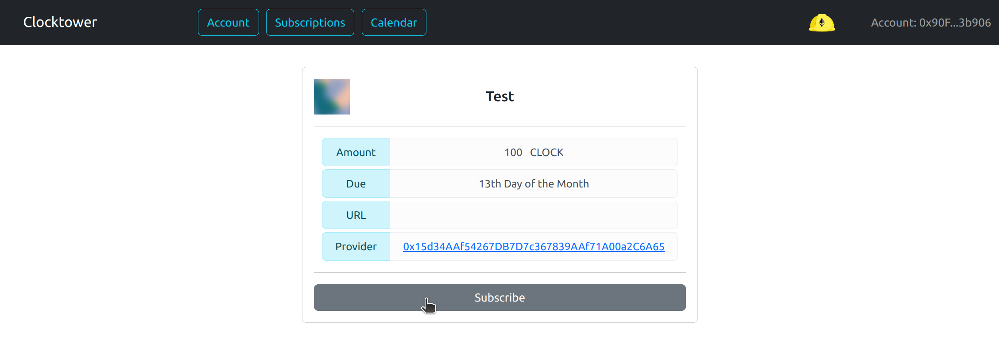
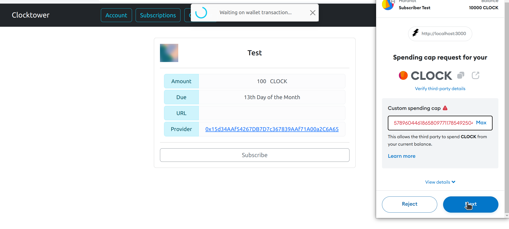
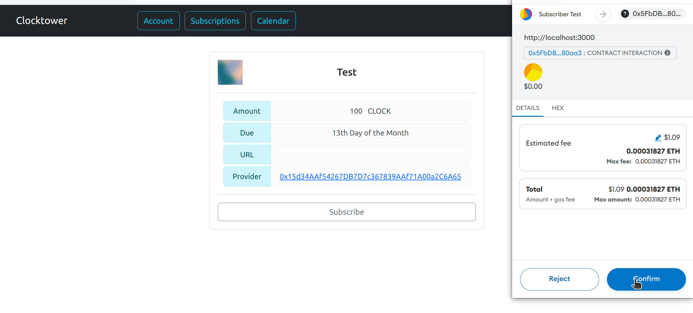
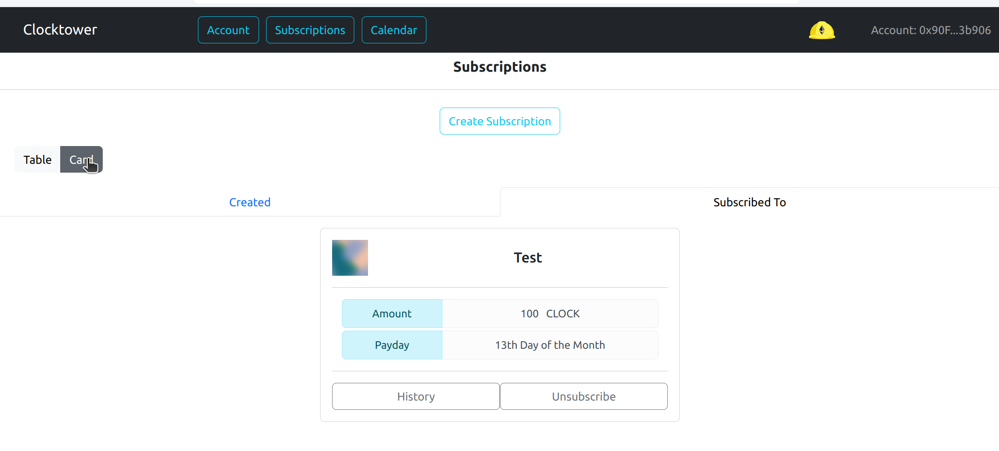
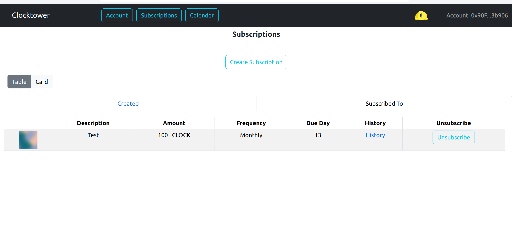

# Subscribe

### Steps to Subscribe

1. Open the public link to the subscription in the browser

2. Make sure to select the account you want to subscribe with in the browser

3. Double check the details of the subscription to make sure you want to subscribe to it

4. Click on the subscribe button 

5. If you have not done so before complete the allowance transaction so the contract can charge the subscription amount to your account in the future. 

6. Complete the subscribe transaction (This transaction will charge you a prorated amount up to the next payment date)

7. You should see the new subscription in your account page under the subscriptions tab

