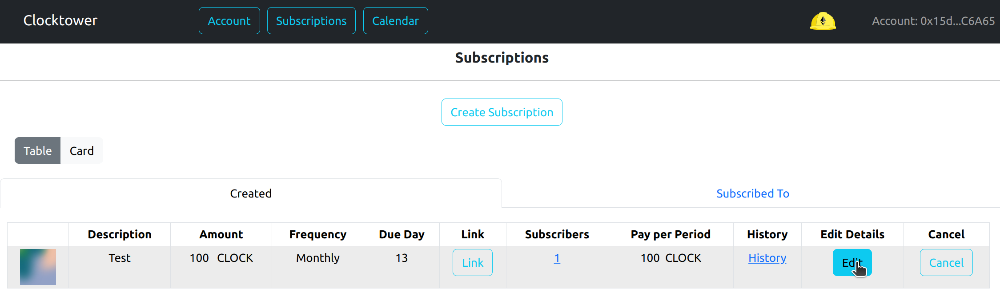
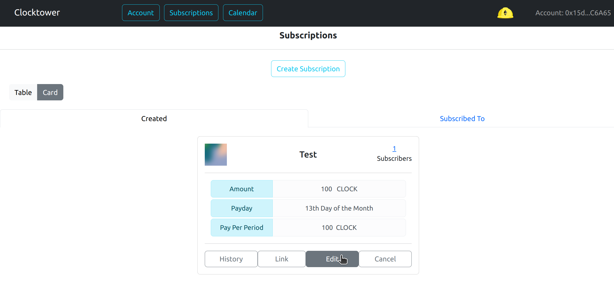
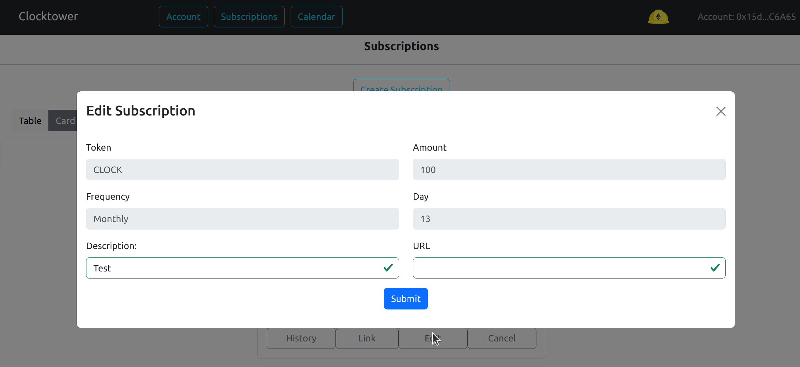
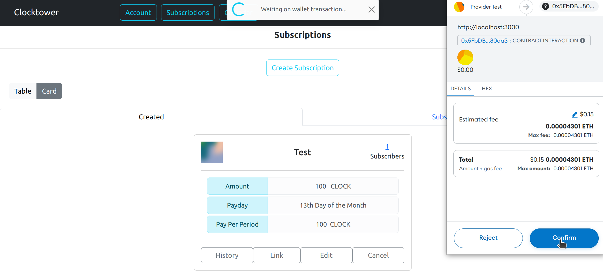

# Edit subscription details

### Steps to editing subscription details

1. Make sure the "Created" tab is selected

2. Click on the "Edit" button of the subscription you wish to change

3. Change the "Description" and/or "URL" fields. (The others cannot be edited)

4. Confirm the transaction 

