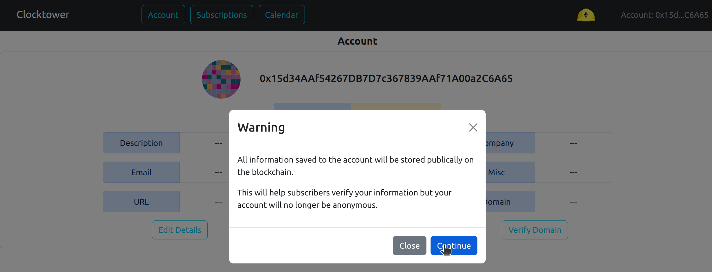
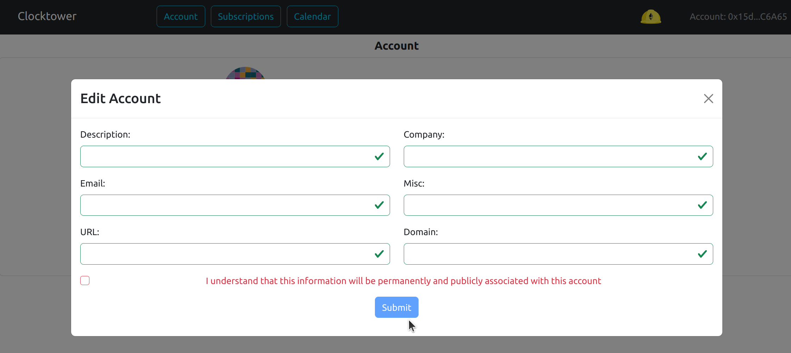
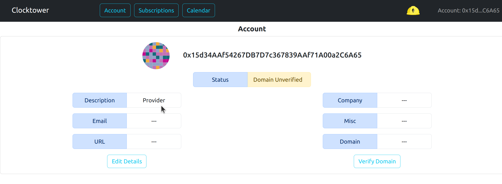

# Add / Edit provider details

### Warning

All information saved to the account will be stored publically on the blockchain.

This will help subscribers verify your information but your account will no longer be anonymous.

### Optional Parameters

| Parameter | Description |
|---|---|
| Description | Description of provider |
| Company | Name of provider Company |
| Email | Email address of provider | 
| Misc | Miscellaneous field |
| URL | URL of provider |
| Domain | Domain of provider |

### Steps to add provider details

1. Click on "Account" button in menu

2. Click on "Edit" button

3. See above warning and click through warning screen

4. Add in Provider details into fields making sure to click the checkbox.

5. Complete the transaction

6. The changes should be listed on your account

