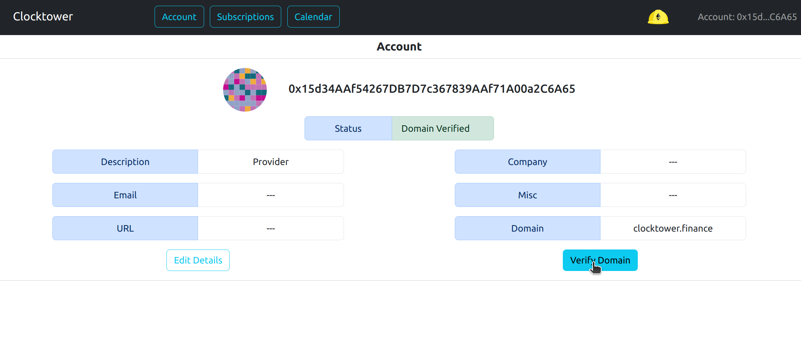
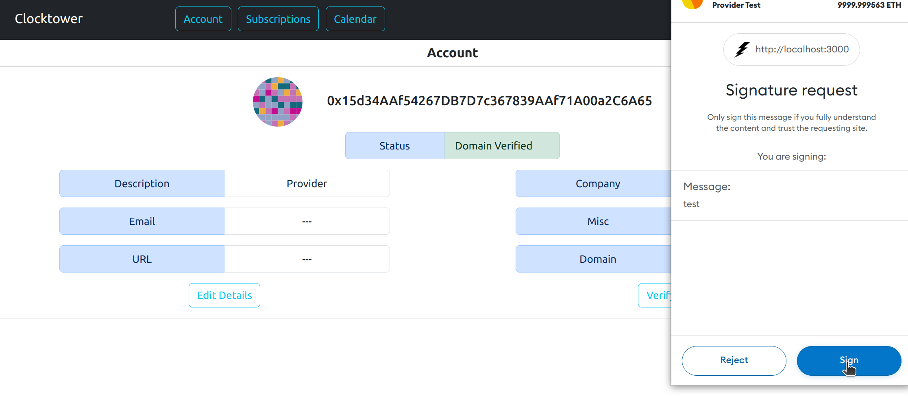

# Verify domain

### Warning

Warning this feature is experimental. Use at your own risk

### Steps to verifying your domain

1. Click on "Account" button in menu

2. Make sure that you have [added](./add_details) a domain to your account. 

Click the "Verify Domain" button

3. Sign the transaction with your wallet

4. Follow the instructions onscreen to change your dns record 

5. If everything is setup correctly in the dns record the "Status" on your account should be green with "Domain Verified"

