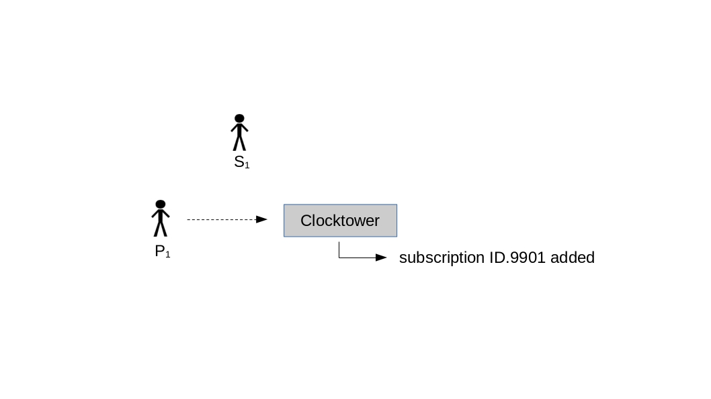
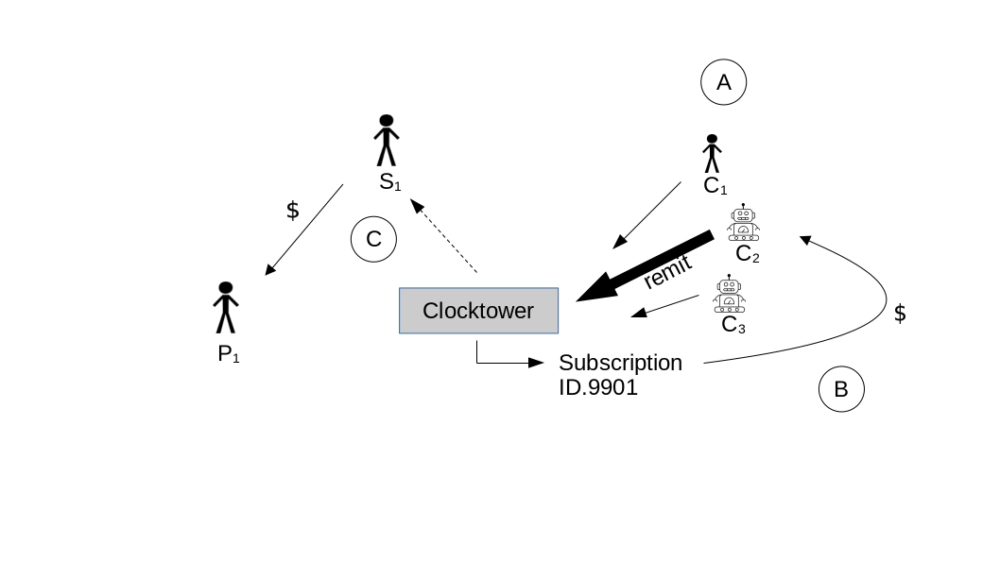

 
# Abstract

Clocktower is an Ethereum Virtual Machine (EVM)-based, decentralized protocol for recurrent payments of ERC-20 tokens. Clocktower allows for scheduled payments to be reliably processed in the future *without a central processor*. Use-cases include a variety of financial and commercial possibilities such as mortgage, rent, bond payments, estate planning, subscriptions for goods and services and many others. This whitepaper will detail the problems solved by Clocktower and a technical overview of the protocol.
   
   

# The Three Problems

Clocktower solves three problems:

#### Problem: EVM Contracts are not Time-Aware

Smart contracts have inherent limitations. One of the more important for recurrent payments is that smart contracts are not actually aware of time unless acted upon by an externally owned account (EOA). The contract is like a person who is wearing a watch but can only look at it when instructed to do so. This limitation makes automatic scheduling infeasible. Without the ability to schedule transactions in the future, common financial services are not possible in current decentralized systems. 

#### Solution: Incentivized Polling

Clocktower employs a novel incentivized polling mechanism in order to ensure proper execution of future transactions. An initial payment contributes to a fee balance stored in the contract for the account and this fee becomes the ongoing reward to those who instruct the contract to check the time (ie, Callers), which occurs through the contract's _remit_ function. The fee is set at a fixed percentage and the Caller recieves payment in proportion to the number of payments made as compensation for the effort and the gas costs for the transactions.

All payments are made in-kind to avoid the need for oracles, which is an overall goal of the protocol [@goals]. A token minimum is also set by the contract such that the caller can be compensated for gas costs. 


#### Problem: Conflicting Systems of Time

Humans and computers use different systems of time. Unix-based computers use a more simple system called Unix Epoch Time, in which a number increments every second from January 1st, 1970. Unfortunately, the natural world does not increment as cleanly--a full revolution of the Earth around the sun is actually the equivalent of 365.24 days and so every 4 years, an extra day (ie, leap day) is added to the modern Gregorian calendar on February 29. 

Moreover, scheduled recurrent payments are an open-ended time series and one can't easily save an open-ended series with an incrementing number. For instance, there's no sane way to save the date "every 5th day of the month" using just unix time. One could theoretically save a long series of calculated dates in seconds after midnight January 1st 1970. But this is inefficient and creates an edge case if the subscription goes longer than the initial series of numbers. 

#### Solution: Real-Time Conversion

A much simpler solution is to use a Gregorian calendar point converted in real-time to unix epoch time in the contract. The best way to translate the unix epoch block timestamp to Gregorian ranges is to use an intermediary incrementing day standard called Julian Days. Using the following code, the Clocktower contract can perform this translation without Oracles or any other external sources [@bokkypoobah],[@navy]. As an example:

```
function unixToTime(uint unix) internal pure returns (Time memory time) {
       
    uint _days = unix/86400;
    uint16 day;
    uint16 yearDay;
       
    int __days = int(_days);

    int L = __days + 68569 + 2440588;
    int N = 4 * L / 146097;
    L = L - (146097 * N + 3) / 4;
    int _year = 4000 * (L + 1) / 1461001;
    L = L - 1461 * _year / 4 + 31;
    int _month = 80 * L / 2447;
    int _day = L - 2447 * _month / 80;
    L = _month / 11;
    _month = _month + 2 - 12 * L;
    _year = 100 * (N - 49) + _year + L;

    uint uintyear = uint(_year);
    uint month = uint(_month);
    uint uintday = uint(_day);

    day = uint16(uintday);       
    ...
```

#### Problem: Malicious Collusion Between the Three Parties

As previously mentioned, the Clocktower system requires a three-party incentivised polling system for it's decentralized recurrent payments. The three user categories are named for their functions in a subscription service, although the protocol has many potential use-cases outside of this model. At its core, Clocktower is a series of functions that allow two parties, a Subscriber and a Provider, to orchestrate recurrent payments for a service or good with the help of a third party, an incentivized polling agent referred to as the Caller. While not immediately apparent, the permissionless nature of Clocktower creates gameable edge-cases when a user could play two roles at the same time, and potentially extract value from the third party. 

The most immediate question of the system operation is: who pays the fees for the Caller? One might initially think that the provider should pay a portion of their earnings for this purpose. This seems simpler since there is only one provider and they are the one's receiving all the funds for a given subscription. However, there is an attack vector if we use this structure. Since we have no way of knowing the ownership of an ethereum address it is possible that combinations of the subscriber, provider and caller can be the same entity.

If the Subscriber and Caller are the same while the Provider pays the fee, the subscriber could sign up for a subscription and but not fund their account. When the transaction fails the fee would still be extracted from the Provider and paid to the Caller (who is also the Subscriber in this case.) If the fee is higher than the gas costs of signing up for the subscription, then the malicious subscriber now has a method of extracting tokens from the provider. 

#### Solution: Dynamic Refunding

By dynamicly refunding mechanism coded in the contract, one can avoid many of the attack vectors by refunding to the party that would not benefit from the action taken. 

| Initiator | Action | Amount | Refunds Sent to |
|---|---|---|---|
| Subscriber | Fail due to Approval | Partial Caller / Partial Provider | Caller / Provider |
|     |     |      |      |
| Subscriber | Fail due to low funds | Partial Caller / Partial Provider | Caller / Provider |
|     |     |      |      |
| Subscriber | Unsubscribes | All remaining | Provider | 
|     |     |      |      |
| Provider | Provider unsubscribers subscriber | All remaining | Subscriber |
|     |     |      |      |
| Provider | Cancels overall subscription | All remaining on all subscribers | Subscribers |

Refunding after a cancellation has also been carefully considered. A given subscription can be terminated unilaterally either by the Subscriber or the Provider. The general rule here is to refund any extra funds to the party *not* doing the cancelling. This eliminates the potential for one party to benefit monetarily from cancelling the service. 

Proration is also important considerations. Without proration, Providers would be given more than deserved for most initial payments from Subscribers (ie, anyone who doesn't sign up on the exact day of a new cycle). As such, the contract makes a proration calculation with each new signup:

```
prorate(block.timestamp, subscription.dueDay, fee, uint8(subscription.frequency))

...
        
if(subscription.frequency == Frequency.MONTHLY || subscription.frequency == Frequency.WEEKLY){
    fee = prorate(block.timestamp, subscription.dueDay, fee, uint8(subscription.frequency));
        } 
else if(subscription.frequency == Frequency.QUARTERLY) {
    fee = prorate(block.timestamp, subscription.dueDay, fee, uint8(subscription.frequency));
    fee /= 3;
    multiple = 2;
}
else if(subscriptions.frequency == Frequency.YEARLY) {
    fee = prorate(block.timestamp, subscription.dueDay, fee, uint8(subscription.frequency));
    fee /= 12;
    multiple = 11;
} 
```


## Lifecycle: The Three Users

This section explores the main actors and lifecycle of the protocol, which can be modeled as a three phase process. 

{ width=70% }

#### Creation
In the creation phase (see Figure 1) a Provider configures a good or service they would like to provide at a fixed interval (weekly, monthly, yearly, etc). This can be done through direct interaction with the contract or, in most cases, through a website providing a simple user interface. Regardless, this process involves a Provider making a function call to the Clocktower contract, specifying parameters of the subscription includiong the amount of the payment, ERC20 token(s) accepted, description/details of the subscription to be saved in call data, the payment interval, and the due date of the payment.
\
```
function createSubscription(uint amount, address token, Details calldata details, 
    Frequency frequency, uint16 dueDay) external payable {
    ...
```
A subscription ID is then generated and added to the subscription index of the contract. A subscription can also be destroyed through related contract functions called by the same Provider.
/ 


{ width=70% }

#### Initiation
After the Provider creates the subscription, the good or service is now available to anyone who would like to set-up recurrent payments (see Figure 2). Off-chain, the Provider advertises the service to potential Subscribers who can sign-up via link (A). Again, either through direct interaction with the contract via scripts or more likely, a web portal, a potential Subscriber will make two transactions (B). The first calls the _approve_ function to the appropriate ERC-20 contract, which allows the contract to make future draws of the token from the specified EOA. The next transaction will call _subscribe_, which takes the Subscription struct parameters. The contract then makes a number of validation checks, most importantly that there is proper allowance and that there is enough of the token to cover the subscription amount. If valid, the Subscriber is added to the contract index (C)for the EOA and the first payment is made to fill the fee balance. A proration calculation ensures that the Subscriber does not overpay based on the day of the cycle that he begins his subscription.
/

{ width=70% }


#### Incrementation
After the initial transactions have occurred, there are no further requirements on the Subscriber, other than keeping his EOA balance sufficient to cover the costs of the recurrent payments. An incentivized polling agent known as a Caller, is key to the extension of recurrent payments into the future. The Caller role is simple: call a single function, _remit_ , on the Clocktower contract (A). This is the mechanism through which the contract becomes 'time aware.' _remit_ calculates the current day (the most atomic unit of a recurrent payment in Clocktower_V1) and confirms that the contract subscription index has not yet been checked on this day. If it has already been checked, the function terminates and an error code is returned. If the index has not yet been checked, the contract loops through all subscriptions to see if any payment is due. Those payments that are due and have sufficient fee balances, are remitted to the appropriate Provider (C) and the fee is paid to the Caller (B).

There are a few other important parts of the _remit_ function. First, in cases where a subscriber does not have sufficient fee balance to cover the full fee for the recurrent payment, the contract performs a special transaction where it refills the fee balance, much as it did when the Subscriber first signed-up for the service, in the Initiation phase. This feefill will need to occur regularly during the life of the recurrent payment, depending on the frequency  of the subscription. Importantly, in the event that a Subscriber's balance has fallen below the level of the recurrent payment amount but can still cover the fee and/or feebalance, the contract will continue to perform these actions--this ensures that the Caller is not penalized for Subscribers with low balances. 

If a Subscriber's balance then falls below the level of the subscription fee, _remit_ goes into failure mode. The Subscriber is automatically removed from the subscription list and the remainder of the fee is sent to the Provider of the subscription. 


## Conclusion
In the past few years, decentralized finance has devloped rapidly. Lending protocols and decentralized exchanges have become essential primatives, but a system of scheduling future payments has been absent. Clocktower is the missing piece of defi.
\


pandoc v3_whitepaper.md  --from=markdown+multiline_tables --to=pdf --filter=pandoc-citeproc --bibliography=v2_whitepaper.bib  --output=v3_whitepaper.pdf