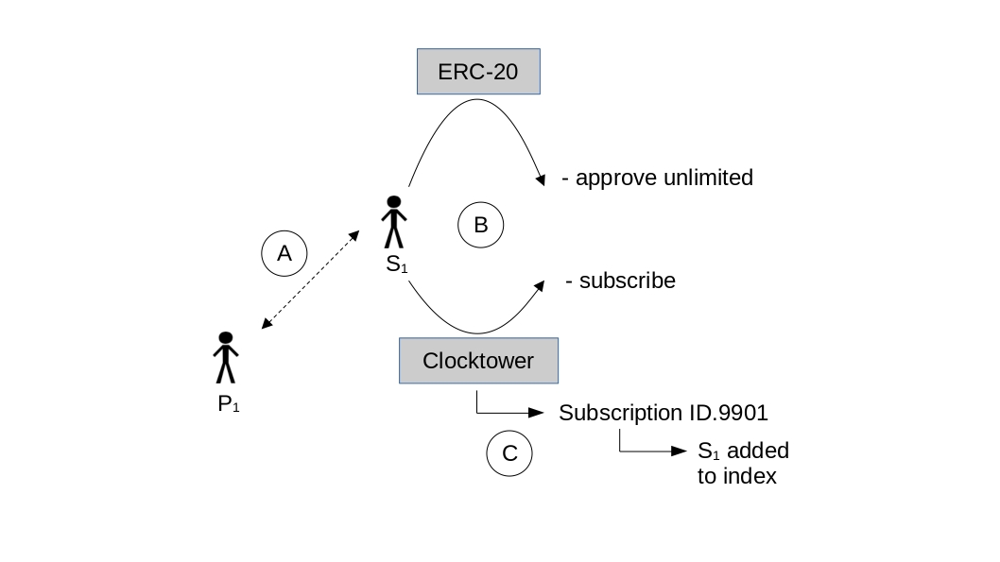
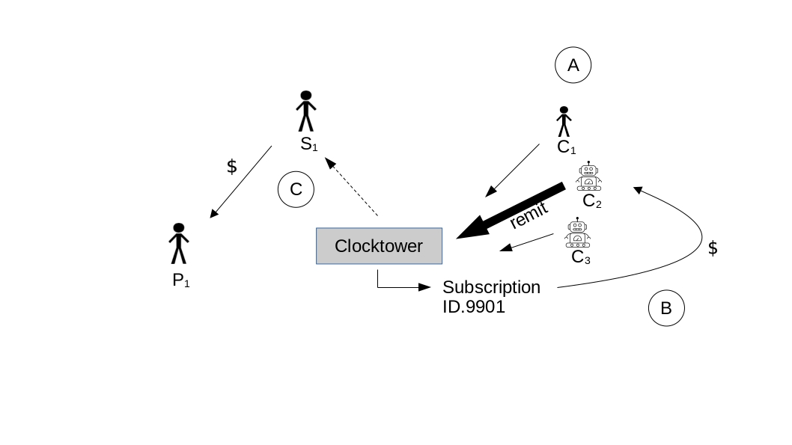

 
# Abstract

Clocktower is an Ethereum Virtual Machine (EVM)-based, decentralized protocol for recurrent payments of ERC-20 tokens. Clocktower allows for scheduled payments to be reliably processed in the future *without a central processor*. The system employs a series of functions that allow two parties, a Subscriber and a Provider, to orchestrate recurrent payments for a service or good with the help of a third party, an incentivized polling agent referred to as the Caller[^1]. Use-cases include a variety of financial and commercial possibilities such as mortgage, rent, bond payments, estate planning, subscriptions and many others. This whitepaper will detail the problems solved by Clocktower and a technical overview of the protocol.
\
   
[^1]: The three user categories are named for their functions in a subscription service, although the protocol has many potential use-cases outside of this model.

# The Three Problems

Clocktower solves three problems:

#### Problem 1: EVM Contracts are not Time-Aware

Smart contracts have inherent limitations. One of the more important for recurrent payments is that smart contracts are not actually aware of time unless acted upon by an externally owned account (EOA). The contract is like a person who is wearing a watch but can only look at it when instructed to do so. This limitation makes automatic scheduling infeasible. Without the ability to schedule transactions in the future, common financial services are not possible in current decentralized systems. 

#### Solution: Incentivized Polling

Clocktower employs a novel incentivized polling mechanism in order to ensure proper execution of future transactions. An initial payment contributes to a fee balance stored in the contract for the account and this fee becomes the ongoing reward to those who instruct the contract to check the time (ie, Callers), triggered through the contract's _remit_ function. The fee is set at a fixed percentage and the Caller recieves payment in proportion to the number of payments made as compensation for the effort and the gas costs for the transactions.

All payments are made in-kind to avoid the need for oracles, which is an overall goal of the protocol [^2]. A token minimum is also set by the contract such that the Caller can be compensated for gas costs. 

[^2]: Marx, H. (2024). Clocktower protocol goals. https://clocktower.finance/docs/goals.


#### Problem 2: Conflicting Systems of Time

Humans and computers use different systems of time. Unix-based computers use a system called Unix Epoch Time, in which a number increments every second from January 1st, 1970. Unfortunately, the natural world does not increment as cleanly--a full revolution of the Earth around the sun is the equivalent of 365.24 days and so every 4 years, an extra day (ie, leap day) is added to the modern Gregorian calendar on February 29. 

Moreover, scheduled recurrent payments are an open-ended time series and one can't easily save an open-ended series with an incrementing number. For instance, there's no sane way to save the date "every 5th day of the month" using just unix time. One could theoretically save a long series of calculated dates in seconds after midnight January 1st 1970. But this is inefficient in that the series would need to be reset if the subscription goes longer than the initial series of numbers. 

#### Solution: Real-Time Conversion

A much simpler solution is to use a Gregorian calendar point converted in real-time to unix epoch time in the contract. The best way to translate the unix epoch block timestamp to Gregorian ranges is to use an intermediary incrementing day standard called Julian Days. Using the following code, the Clocktower contract can perform this translation without Oracles or any other external sources [^3]  [^4]. As an example:
\

[^3]: Bokkypoobah (2019). BokkyPooBahsDateTimeLibrary. https://github.com/bokkypoobah/BokkyPooBahsDateTimeLibrary.
[^4]: Navy, U.S. Converting between julian dates and gregorian calendar dates. https://aa.usno.navy.mil/faq/JD_formula.

```
function unixToTime(uint unix) internal pure returns (Time memory time) {
       
    uint _days = unix/86400;
    uint16 day;
    uint16 yearDay;
       
    int __days = int(_days);

    int L = __days + 68569 + 2440588;
    int N = 4 * L / 146097;
    L = L - (146097 * N + 3) / 4;
    int _year = 4000 * (L + 1) / 1461001;
    L = L - 1461 * _year / 4 + 31;
    int _month = 80 * L / 2447;
    int _day = L - 2447 * _month / 80;
    L = _month / 11;
    _month = _month + 2 - 12 * L;
    _year = 100 * (N - 49) + _year + L;

    uint uintyear = uint(_year);
    uint month = uint(_month);
    uint uintday = uint(_day);

    day = uint16(uintday);       
    ...
```
\

#### Problem 3: Fee Methodology

The most immediate question of the system's operation is: who pays the fees for the Caller? One might initially think that the Provider should pay a portion of their earnings for this purpose. This seems simpler since there is only one Provider and they are the one receiving all the funds for a given subscription. However, this would require the contract having access to the Provider account and also creates attack vectors where the three parties could collude or could be the same entity.

#### Solution: Prepayment of Fees and Dynamic Refunding

A much better solution is to have the Subscriber prepay the amount when they subscribe. This guarantees that there will be funds in the account to pay the Caller even if the Subscriber does not have enough funds or revokes approval. But what happens to these tokens on the account when a refunding event occurs? Through encoding a dynamic refunding mechanism in the contract, we can properly incentivize refunding behavior. This is achieved by refunding the party that would *not* benefit from the action taken (see Table 1). 
\

| Initiator | Action | Amount | Refunds Sent to |
|---|---|---|---|
| Subscriber | Fail due to Approval | Partial Caller / Partial Provider | Caller / Provider |
|     |     |      |      |
| Subscriber | Fail due to low funds | Partial Caller / Partial Provider | Caller / Provider |
|     |     |      |      |
| Subscriber | Unsubscribes | All remaining | Provider | 
|     |     |      |      |
| Provider | Provider unsubscribes subscriber | All remaining | Subscriber |
|     |     |      |      |
| Provider | Cancels overall subscription | All remaining on all subscribers | Subscribers |
\begin{center}Table 1 - Refund Rules\end{center}
\

For example, a given subscription can be terminated unilaterally either by the Subscriber or the Provider. The general rule here is to refund any extra funds to the party not cancelling. This eliminates the potential for one party to benefit monetarily from cancelling the service. 

Proration is also an important consideration. Without proration, Providers would be given more than deserved for most initial payments from Subscribers (ie, anyone who doesn't sign up on the exact day of a new cycle). As such, the contract makes a proration calculation with each new signup:
\

~~~
function prorate(uint unixTime, uint40 dueDay, uint fee, uint8 frequency) internal pure returns (uint)  {
    Time memory time = unixToTime(unixTime);
    uint currentDay;
    uint max;
    uint lastDayOfMonth;
    
    //sets maximum range day amount

    ...
    //monthly
    } else if (frequency == 1){
        //calculates maximum days in current month
        lastDayOfMonth = getDaysInMonth(time.year, time.month);
        currentDay = time.dayOfMonth;
        max = lastDayOfMonth;

    ...
    //monthly
    if(frequency == 1) {
        uint dailyFee = (fee * 12 / 365);
        if(dueDay != currentDay && currentDay > dueDay){
                //dates split months
                fee = (dailyFee * (max - (currentDay - dueDay)));
        } else if (dueDay != currentDay && currentDay < dueDay) {
                //both dates are in the same month
                fee = (dailyFee * (dueDay - currentDay));
        }
    }

    ...
    return fee;
}

    ...

    if(subscription.frequency == Frequency.MONTHLY || subscription.frequency == Frequency.WEEKLY){
            fee = prorate(block.timestamp, subscription.dueDay, fee, uint8(subscription.frequency));
        } 
    ...
~~~


# Lifecycle: The Three Users

This section explores the main actors and lifecycle of the protocol, which can be modeled as a three phase process: creation, initiation, and incrementation.

{ width=75% }

#### Creation
In the creation phase (see Figure 1) a Provider configures a subscription they would like to provide at a fixed interval (weekly, monthly, yearly, etc). This can be done through direct interaction with the contract or, in most cases, through a website providing a simple user interface. Regardless, this process involves a Provider making a function call to the Clocktower contract, specifying parameters of the subscription including the amount of the payment, ERC20 token(s) accepted, description/details of the subscription to be emitted in logs, the payment interval, and the due date of the payment.
\
```
function createSubscription(uint amount, address token, Details calldata details, Frequency frequency, uint16 dueDay) 
    external payable {
    ...
```
\
A subscription ID is then generated and added to the subscription index of the contract. A subscription can also be destroyed through related contract functions called by the same Provider.
\ 


{ width=75% }


#### Initiation
After the Provider creates the subscription, it is now available to anyone who would like to set-up recurrent payments (see Figure 2). Off-chain, the Provider advertises the service to potential Subscribers who can sign-up via link (A). Again, either through direct interaction with the contract via scripts or more likely, a web portal, a potential Subscriber will make two transactions (B). The first calls the _approve_ function to the appropriate ERC-20 contract, which allows the contract to make future draws of the token from the specified EOA. The next transaction will call _subscribe_, which takes the Subscription struct parameters. The contract then makes a number of validation checks, most importantly that there is proper allowance and that there is enough of the token to cover the subscription amount. If valid, the Subscriber is added to the contract index (C)for the EOA and the first payment is made to fill the fee balance. A proration calculation ensures that the Subscriber does not overpay based on the day of the cycle that he begins his subscription.
\

{ width=75% }


#### Incrementation
After the initial transactions have occurred, there are no further requirements on the Subscriber, other than keeping his EOA balance sufficient to cover the costs of the recurrent payments. An incentivized polling agent known as a Caller, is key to the extension of recurrent payments into the future. The Caller role is simple: call a single function, _remit_ , on the Clocktower contract (A). This is the mechanism through which the contract becomes 'time aware.' _remit_ calculates the current day (the most atomic unit of a recurrent payment in Clocktower_V1) and confirms that the contract subscription index has not yet been checked on this day. If it has already been checked, the function terminates and an error code is returned. If the index has not yet been checked, the contract loops through all subscriptions to see if any payment is due. Those payments that are due and have sufficient fee balances, are remitted to the appropriate Provider (C) and the fee is paid to the Caller (B).

There are a few other important parts of the _remit_ function. First, in cases where a Subscriber does not have sufficient fee balance to cover the full fee for the recurrent payment, the contract performs a special transaction where it refills the fee balance, much as it did when the Subscriber first signed-up for the service, in the Initiation phase. This feefill will need to occur regularly during the life of the recurrent payment, depending on the frequency  of the subscription. Importantly, in the event that a Subscriber's balance has fallen below the level of the recurrent payment amount but can still cover the fee and/or feebalance, the contract will continue to perform these actions--this ensures that the Caller is not penalized for Subscribers with low balances. 

If a Subscriber's balance then falls below the level of the subscription fee, _remit_ goes into failure mode. The Subscriber is automatically removed from the subscription list and the remainder of the fee is sent to the Provider of the subscription. 
\

## Conclusion
In the past few years, decentralized finance has developed rapidly. Lending protocols and decentralized exchanges have become essential primatives, but a system of scheduling future payments has been absent. Clocktower is this missing piece of DeFi, allowing for payroll, subscriptions, and other recurrent payments to be automated on EVM networks. 
\


