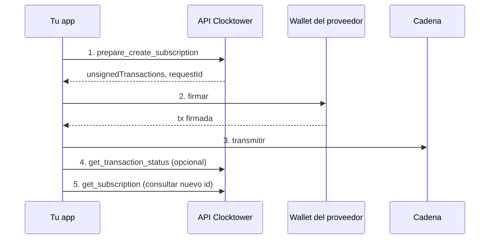

# Flujo de Crear Suscripción

## Objetivo

Un **proveedor** publica una nueva suscripción on-chain para que otros puedan suscribirse a ella.

## Quién participa

| Rol | Qué hace |
|------|----------------|
| **Proveedor** | La dirección de wallet pasada como `from` — crea y posee la suscripción |
| **Tu app** | Construye los parámetros de la suscripción y solicita calldata `createSubscription` sin firmar |
| **API Clocktower** | Simula y devuelve transacciones sin firmar |
| **Wallet** | Firma y transmite a la cadena seleccionada (REST `?chainId=`; MCP siempre Base) |

## Pasos

1. **Preparar creación** — envía monto, token, frecuencia, día de vencimiento y metadatos; recibe calldata `createSubscription` sin firmar.
2. **Firmar** — la wallet del proveedor firma la transacción.
3. **Transmitir** — tu app la envía a la cadena en `unsignedTransactions[].chainId` (MCP: Base mainnet).
4. **Confirmar** (opcional) — consulta el estado de la transacción.
5. **Obtener nuevo ID** — después de minar, lee la suscripción por ID o consulta hasta que aparezca on-chain.

## Diagrama de flujo



## Llamadas por superficie

| Paso | REST | Herramienta MCP | SDK |
|------|------|----------|-----|
| 1. Preparar | `POST /prepare/create_subscription` | `prepare_create_subscription` | `createSubscription()` |
| 2–3. Firmar y transmitir | Tu wallet + RPC | Igual | `walletClient` vía viem |
| 5. Obtener ID | `GET /subscriptions/:id` o búsqueda | `get_subscription` | `waitForSubscription()` |

## Ejemplo de cuerpo de solicitud

```json
{
  "from": "0xProviderAddress",
  "subscription": {
    "amount": "10",
    "token": "0x...",
    "details": { "url": "https://example.com/", "description": "Premium" },
    "frequency": 1,
    "dueDay": 15
  }
}
```

<IfFeature name="sdk">
El SDK acepta cadenas `amount` legibles para humanos y valores del enum `Frequency`. Consulta [Rangos de día de vencimiento](/docs/developers/SDK/reads-and-writes) para `dueDay` válido por frecuencia.
</IfFeature>

En REST, pasa `?chainId=` en prepare y en el `GET /subscriptions/:id` posterior para quedarte en la misma cadena. Create en MCP es solo Base.