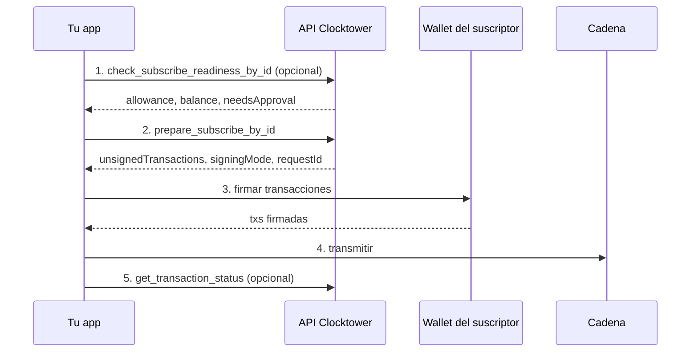

# Flujo de Suscripción

## Objetivo

Un **suscriptor** comienza a pagar en una suscripción **existente** creada por un proveedor.

## Quién participa

| Rol | Qué hace |
|------|----------------|
| **Suscriptor** | La dirección de wallet pasada como `from` — debe tener suficiente ERC-20 y aprobar el contrato Clocktower |
| **Tu app** | Llama a la API/MCP o SDK, luego pide a la wallet que firme |
| **API Clocktower** | Valida la preparación y devuelve transacciones sin firmar (nunca transmite por ti) |
| **Wallet** | Firma transacciones; tu app las transmite a la cadena seleccionada (REST `?chainId=`; MCP `chainId` opcional, default Base) |

:::info Ruta SDK
El SDK omite el paso de preparación y habla con la cadena directamente vía viem cuando llamas `subscribeWithApprovalById()`.
:::

## Pasos

1. **Verificar preparación** (opcional) — confirma allowance, saldo y reglas del protocolo antes de preparar una transacción.
2. **Preparar suscripción** — solicita calldata `subscribe` sin firmar (y una tx `approve` si el allowance es bajo).
3. **Firmar** — la wallet del suscriptor firma `unsignedTransactions`. Si se necesitan dos txs, el modo de firma es `eip5792` (lote approve + subscribe).
4. **Transmitir** — tu app envía la(s) transacción(es) firmada(s) a la cadena en `unsignedTransactions[].chainId`.
5. **Confirmar** (opcional) — consulta el estado de la transacción o espera un recibo on-chain.

El servidor nunca guarda tus claves ni retransmite transacciones firmadas.

## Diagrama de flujo

## Llamadas por superficie

| Paso | REST | Herramienta MCP | SDK |
|------|------|----------|-----|
| 1. Preparación | `POST /check_subscribe_readiness_by_id` (**preferido**) o forma objeto | `check_subscribe_readiness_by_id` | `checkSubscribeReadiness({ subscriptionId, account })` |
| 2. Preparar | `POST /prepare/subscribe_by_id` (**preferido**) o forma objeto | `prepare_subscribe_by_id` | `subscribeWithApprovalById()` / `subscribeById()` |
| 3–4. Firmar y transmitir | Tu wallet + RPC | Igual | `walletClient` vía viem |
| 5. Confirmar | `POST /transactions/status` | `get_transaction_status` | `waitForReceipt: true` |

Las rutas REST by-id solo necesitan `from` + `id` de suscripción (amount/token/provider se cargan on-chain). La forma por objeto sigue en REST/MCP si ya tienes el objeto completo. La superficie de subscribe del SDK es **solo por id**.

En REST, pasa el mismo `?chainId=` en readiness, prepare y `POST /transactions/status` (`{ "txHash": "0x…" }`). En MCP, pasa el mismo `chainId` en esas tools y consulta `get_transaction_status` con `txHash`. Ver [Selección de cadena REST](/docs/developers/REST%20API/chain-selection) y [Selección de cadena MCP](/docs/developers/MCP/mcp-chain-selection).

<IfFeature name="builder">
Las sesiones Builder no pueden llamar rutas REST de escritura `*_by_id` (403 `FORBIDDEN`). Usa `check_subscribe_readiness` / `prepare_subscribe` en forma objeto con token `cts_…`, o by-id en los lanes free/developer. Ver [Endpoints de escritura](/docs/developers/REST%20API/write-endpoints).
</IfFeature>

## Consejos

**Loteo EIP-5792** — cuando el allowance de ERC-20 es insuficiente, la preparación devuelve `signingMode: "eip5792"` con approve + subscribe en un solo lote (approve acotado al amount por defecto; `infiniteApproval: true` para máximo).

**Solo preparación** — pasa `readinessOnly: true` en prepare para validar sin generar transacciones sin firmar.

**Límites REST de prepare** — free y developer keys tienen cupos bajos de prepare/readiness. Para volumen de suscripciones en producción, prefiere el SDK con tu propio RPC.