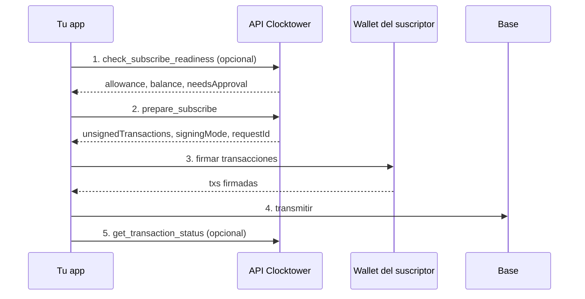

# Flujo de Suscripción

## Objetivo

Un **suscriptor** comienza a pagar en una suscripción **existente** creada por un proveedor.

## Quién participa

| Rol | Qué hace |
|------|----------------|
| **Suscriptor** | La dirección de wallet pasada como `from` — debe tener suficiente ERC-20 y aprobar el contrato Clocktower |
| **Tu app** | Llama a la API/MCP o SDK, luego pide a la wallet que firme |
| **API Clocktower** | Valida la preparación y devuelve transacciones sin firmar (nunca transmite por ti) |
| **Wallet** | Firma transacciones; tu app las transmite a Base |

:::info Ruta SDK
El SDK omite el paso de preparación y habla con la cadena directamente vía viem cuando llamas `subscribeWithApproval()`.
:::

## Pasos

1. **Verificar preparación** (opcional) — confirma allowance, saldo y reglas del protocolo antes de preparar una transacción.
2. **Preparar suscripción** — solicita calldata `subscribe` sin firmar (y una tx `approve` si el allowance es bajo).
3. **Firmar** — la wallet del suscriptor firma `unsignedTransactions`. Si se necesitan dos txs, el modo de firma es `eip5792` (lote approve + subscribe).
4. **Transmitir** — tu app envía la(s) transacción(es) firmada(s) a Base mainnet.
5. **Confirmar** (opcional) — consulta el estado de la transacción o espera un recibo on-chain.

El servidor nunca guarda tus claves ni retransmite transacciones firmadas.

## Diagrama de flujo

## Llamadas por superficie

| Paso | REST | Herramienta MCP | SDK |
|------|------|----------|-----|
| 1. Preparación | `POST /check_subscribe_readiness` | `check_subscribe_readiness` | Integrado en preflight de `subscribe()` |
| 2. Preparar | `POST /prepare/subscribe` | `prepare_subscribe` | `subscribeWithApproval()` |
| 3–4. Firmar y transmitir | Tu wallet + RPC | Igual | `walletClient` vía viem |
| 5. Confirmar | `POST /transactions/status` | `get_transaction_status` | `waitForReceipt: true` |

## Consejos

**Loteo EIP-5792** — cuando el allowance de ERC-20 es insuficiente, la preparación devuelve `signingMode: "eip5792"` con approve + subscribe en un solo lote.

**Solo preparación** — pasa `readinessOnly: true` a `prepare_subscribe` (o `POST /prepare/subscribe` en `api.clocktower.finance`) para validar sin generar transacciones sin firmar.