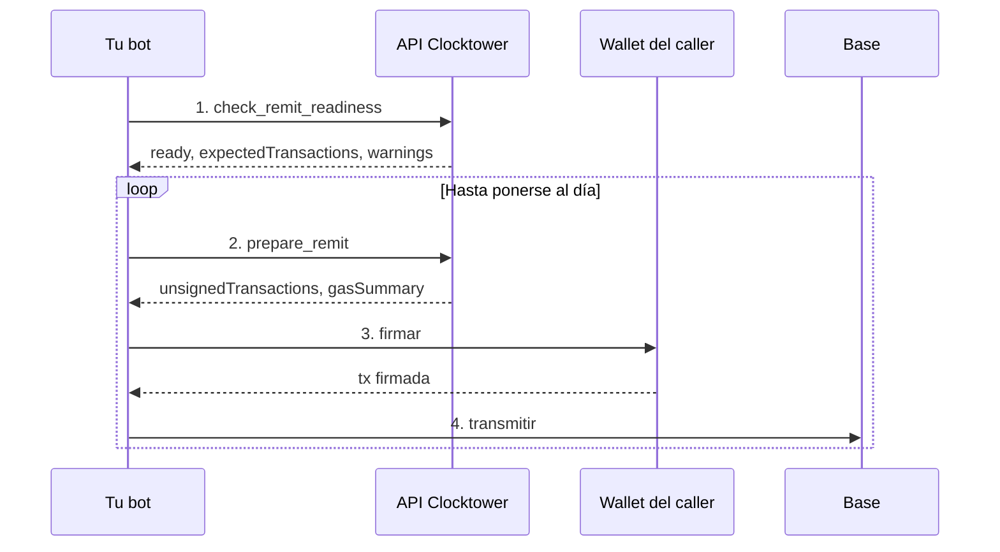

# Flujo de Caller de Remit

## Objetivo

Un **caller** ejecuta la función sin permisos `remit()` para procesar pagos de suscripción vencidos y ganar comisiones de caller en el token ERC-20 de la suscripción.

## Quién participa

| Rol | Qué hace |
|------|----------------|
| **Caller** | Cualquier wallet — paga gas y recibe pagos de comisión de caller |
| **Tu bot** | Verifica preparación, prepara txs de remit, firma y transmite en un bucle |
| **API Clocktower** | Escanea la cola de vencimientos y devuelve calldata `remit()` sin firmar |

## Pasos

1. **Verificar preparación de remit** — escanea cuántas suscripciones están vencidas y si `remit()` puede ejecutarse ahora.
2. **Preparar remit** — obtén calldata `remit()` sin firmar más estimaciones de gas.
3. **Firmar y transmitir** — la wallet del caller firma y tu bot envía a Base.
4. **Repetir** — un `remit()` liquida como máximo `maxRemits` pagos; repite hasta que el backlog esté al día.

El caller paga gas por cada transmisión (a diferencia del cron del operador del protocolo).

## Diagrama de flujo

## Llamadas por superficie

| Paso | REST | Herramienta MCP | SDK |
|------|------|----------|-----|
| 1. Preparación | `POST /check_remit_readiness` | `check_remit_readiness` | `checkRemitReadiness()` |
| 2. Preparar | `POST /prepare/remit` | `prepare_remit` | `remit()` |
| 3–4. Bucle | Repetir hasta ponerse al día | Igual | `runRemitUntilCaughtUp()` |

## Consejos

- Los backlogs grandes pueden necesitar múltiples transmisiones — consulta `gasSummary.backlogMultiplier` en las respuestas de preparación.
- Usa `get_subscriptions_due` / `getSubscriptionsDue()` para una lectura ligera de un solo día sin preparar una transacción.