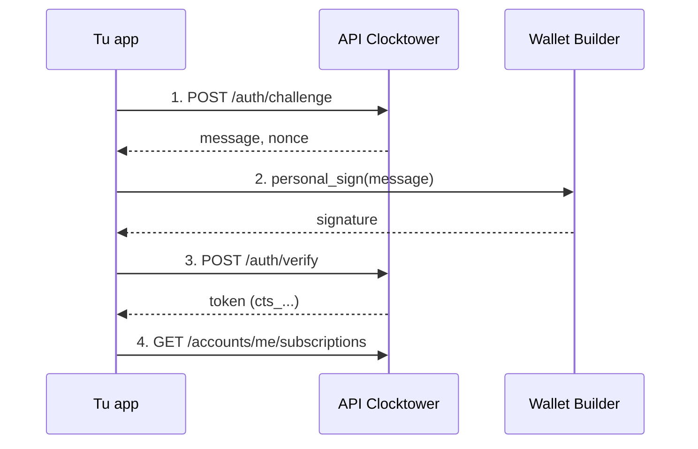

# Flujo de Autenticación Builder

## Objetivo

Obtener una **sesión Builder** para que tus llamadas REST tengan límites de tasa más altos y acceso a rutas `:me` limitadas a tu wallet.

:::info Nivel opcional
Builder es **opcional**. Muchos integradores solo necesitan **free** o **API keys de developer** (`ctk_…`) para lecturas. Consulta `GET /catalog` → `builderAuthEnabled`. Si no hay IDs de entitlement configurados, Builder está desactivado.
:::

Para keys de developer gratuitas y límites de tasa, ver [Autenticación](/docs/developers/REST%20API/authentication) — ese camino **no** requiere SIWE.

## Quién participa

| Rol | Qué hace |
|------|----------------|
| **Builder** | Una wallet con una suscripción on-chain activa a un entitlement Builder configurado (`BUILDER_SUB_ID` / `BUILDER_SUB_IDS`) |
| **Tu app** | Solicita un desafío SIWE, pide a la wallet que firme, intercambia la firma por un token de sesión |
| **API Clocktower** | Emite un token bearer `cts_…` después de verificar la firma y el derecho |

## Requisitos previos

1. El servidor tiene al menos un ID de entitlement Builder configurado y una suscripción on-chain **ACTIVE** para tu wallet **en Base**. El entitlement se comprueba siempre en Base, aunque REST `?chainId=` apunte a otra cadena de protocolo.
2. Una wallet para firmar el mensaje SIWE (el chain ID de SIWE es `8453`).

## Pasos

1. **Solicitar desafío** — `POST /auth/challenge` con tu dirección; recibe un mensaje y nonce.
2. **Firmar** — `personal_sign` de la wallet en el mensaje devuelto.
3. **Verificar** — `POST /auth/verify` con mensaje + firma; recibe token `cts_…`.
4. **Usar rutas Builder** — envía `Authorization: Bearer cts_…` en llamadas posteriores a `api.clocktower.finance` (p. ej. `/accounts/me/subscriptions`).

El token de sesión no es una clave API precompartida — se obtiene vía SIWE y se almacena en caché en el cliente.

## Diagrama de flujo



## Comandos de ejemplo

**Desafío:**

```bash
curl -s -X POST https://api.clocktower.finance/auth/challenge \
  -H "Content-Type: application/json" \
  -d '{ "address": "0xYourAddress" }'
```

**Verificar:**

```bash
curl -s -X POST https://api.clocktower.finance/auth/verify \
  -H "Content-Type: application/json" \
  -d '{ "message": "...", "signature": "0x..." }'
```

**Solicitud autenticada:**

```bash
curl -s https://api.clocktower.finance/accounts/me/subscriptions \
  -H "Authorization: Bearer cts_..."
```

## Ayudante CLI

```bash
npm start rest auth login
npm start rest auth status
npm start rest get /accounts/me/subscriptions
```

Consulta [Autenticación](/docs/developers/REST%20API/authentication) y [Límites de tasa](/docs/developers/REST%20API/rate-limits).