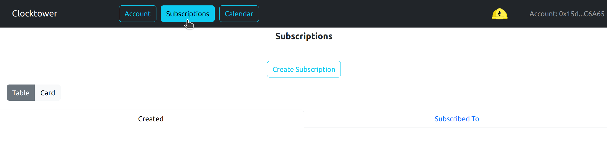
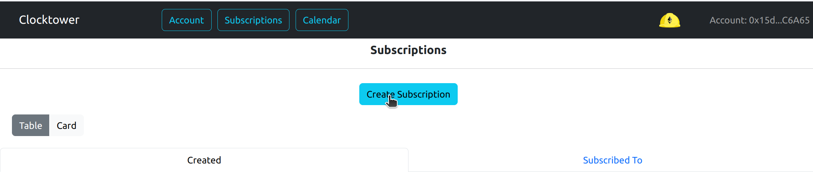
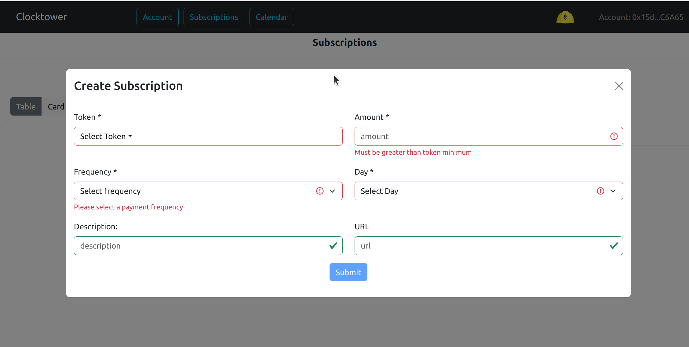
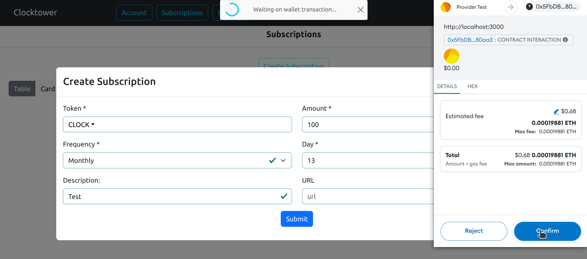
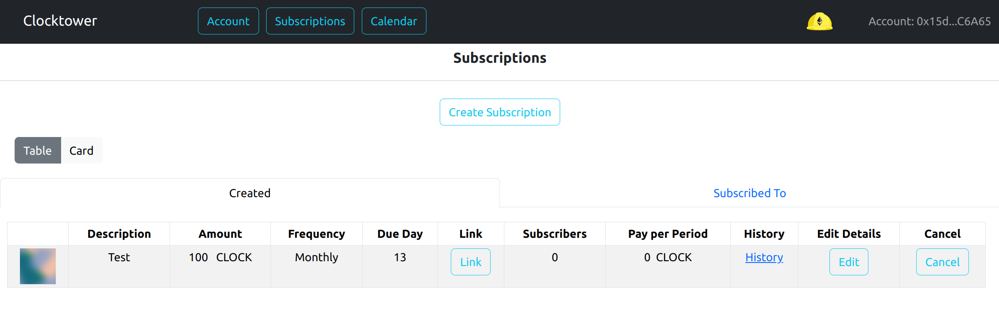
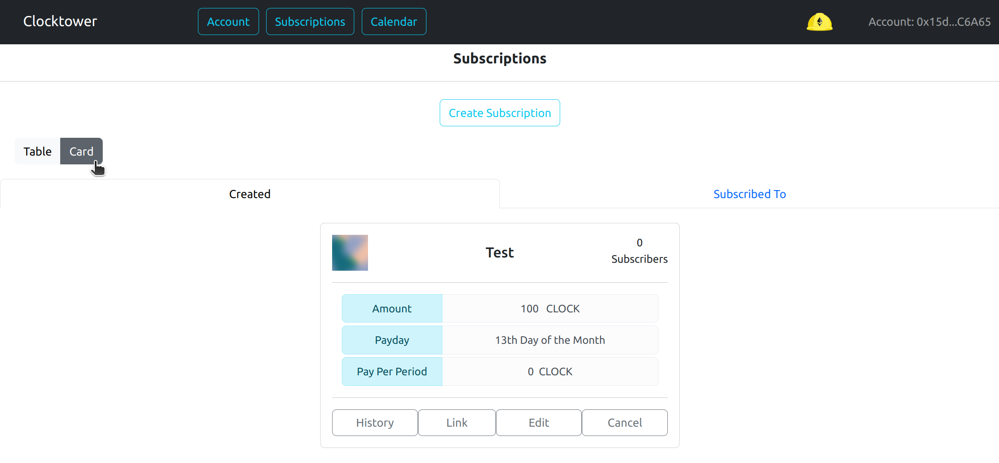

# Crear una suscripción

### Parámetros Requeridos

Todas las suscripciones requieren que se ingrese la siguiente información:

| Parámetro | Descripción |
|---|---|
| Token | Token ERC20 en el que deseas ser pagado. De la lista predefinida |
| Cantidad | Cantidad de tokens que deseas ser pagado por período |
| Frecuencia | Frecuencia de pago. Actualmente semanal, diaria, trimestral o anual |
| Día de Vencimiento | Día de pago en el [rango](../../../contracts/01-Subscribe/01-subscribe_tech_reference.mdx#allowed-time-ranges) determinado por la frecuencia |

### Parámetros Opcionales

| Parámetro | Descripción |
|---|---|
| Descripción | Título breve de la Suscripción | RECOMENDADO |
| URL | Enlace URL a más información sobre la suscripción |

### Pasos para crear una suscripción

1. Haz clic en el botón Suscripciones en el menú superior

2. Haz clic en el botón Crear Suscripción

3. Completa el formulario asegurándote de completar los campos requeridos

4. Completa la transacción en tu billetera

5. La nueva suscripción se mostrará abajo en formato de tabla o tarjeta

