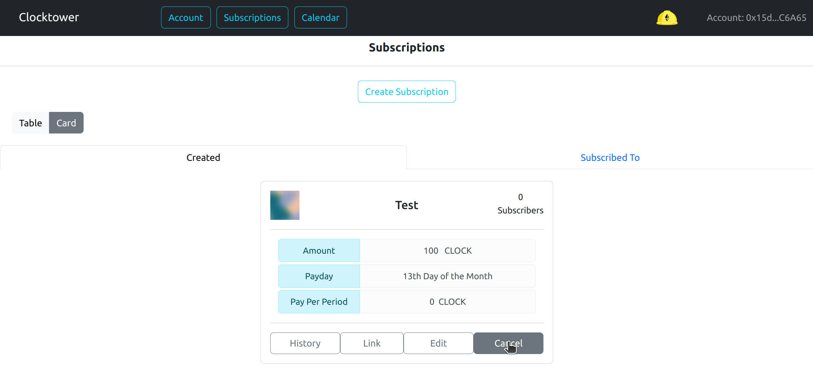
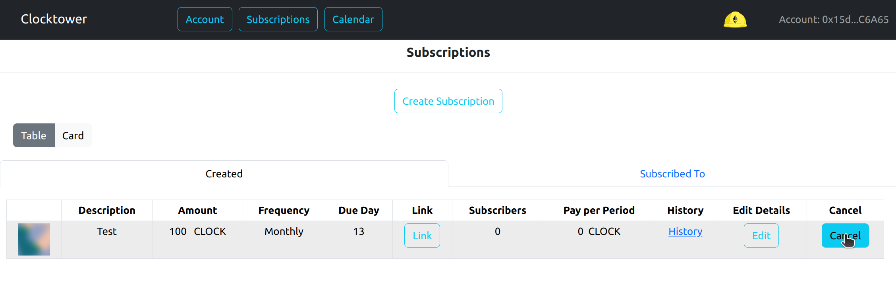
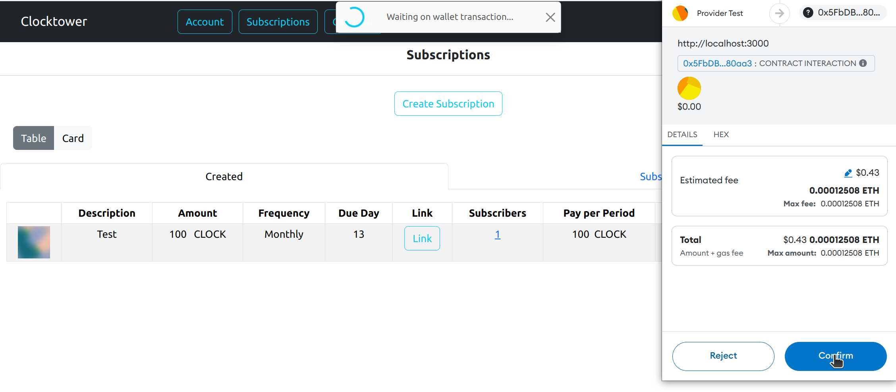

# Cancelar una suscripción

### Advertencia

Cancelar una suscripción dará de baja a todos los suscriptores. Todos los saldos de tarifas restantes serán reembolsados a cada suscriptor respectivamente.

### Pasos para cancelar una suscripción

1. Asegúrate de que la pestaña "Creadas" esté seleccionada

2. Haz clic en el botón cancelar de la suscripción que deseas cancelar

3. Completa la transacción en tu billetera

