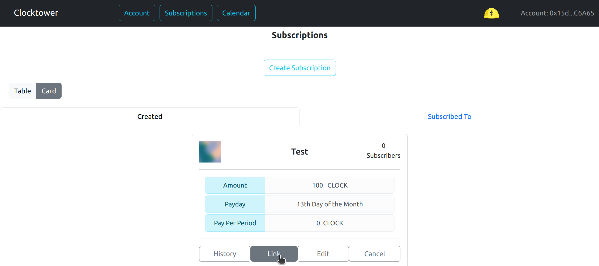
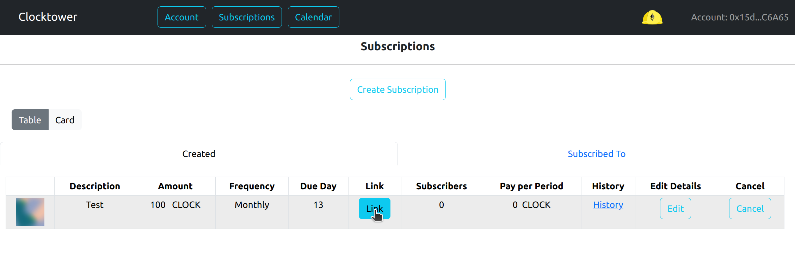
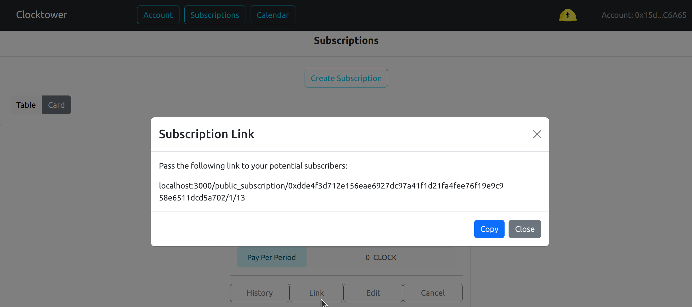

# Crear un enlace público

Lo siguiente muestra cómo un Proveedor puede crear un enlace que puede compartir con suscriptores potenciales

### Pasos para crear un enlace público

1. Asegúrate de que la pestaña "Creadas" esté seleccionada

2. Haz clic en el botón "Enlace" de la suscripción que quieres compartir

3. Copia el enlace y distribúyelo a suscriptores potenciales

