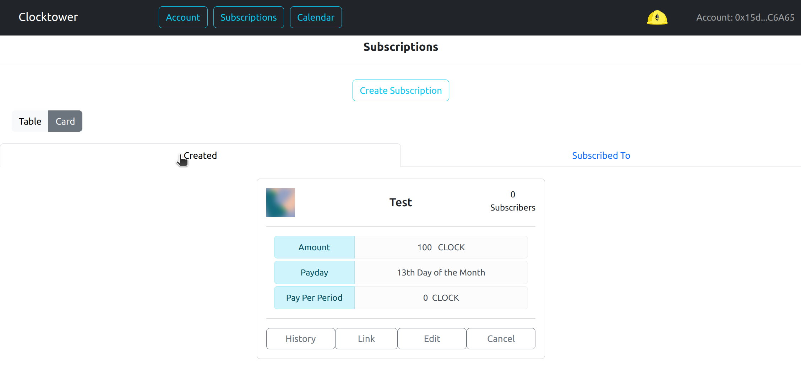
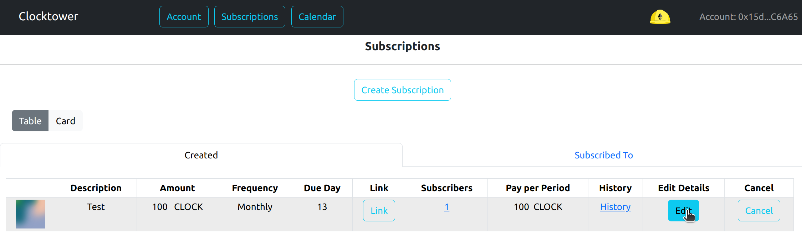
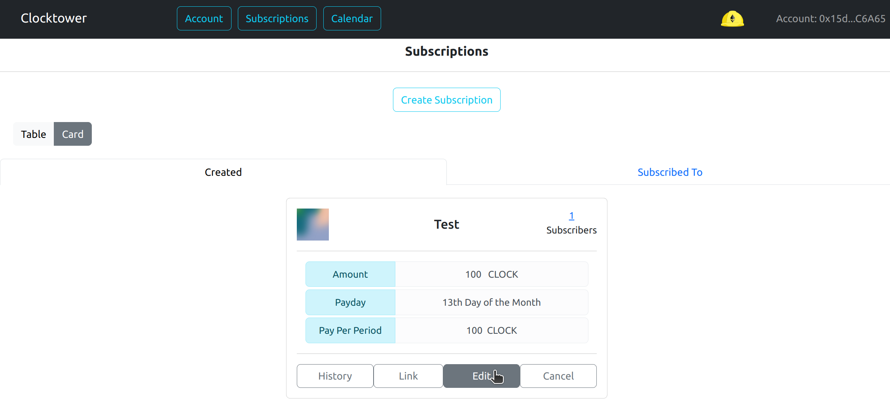
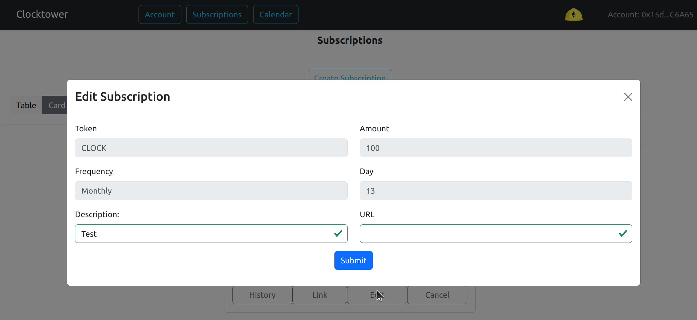
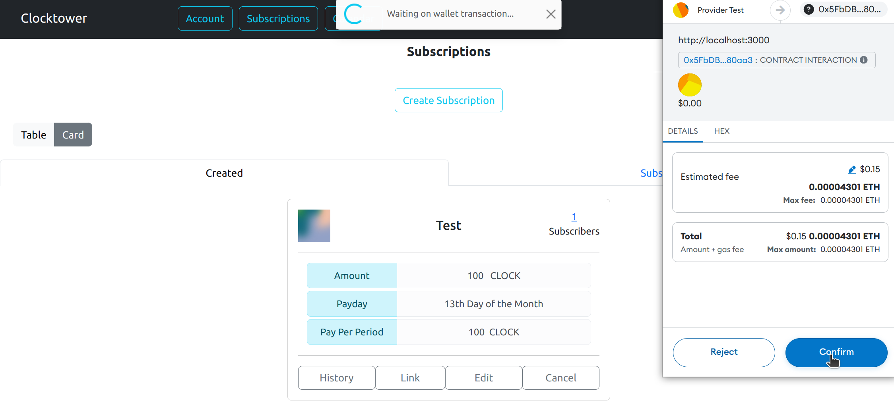

# Editar detalles de suscripción

### Parámetros Opcionales

| Parámetro | Descripción |
|---|---|
| Descripción | Título breve de la Suscripción | RECOMENDADO |
| URL | Enlace URL a más información sobre la suscripción |

### Pasos para editar detalles de suscripción

1. Asegúrate de que la pestaña "Creadas" esté seleccionada

2. Haz clic en el botón "Editar" de la suscripción que deseas cambiar

3. Cambia los campos "Descripción" y/o "URL". (Los otros no se pueden editar)

4. Confirma la transacción

