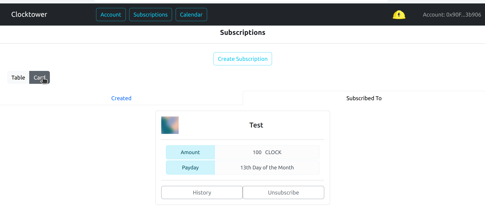

# Suscribirse

### Pasos para Suscribirse

1. Abre el enlace público de la suscripción en el navegador

2. Asegúrate de seleccionar la cuenta con la que quieres suscribirte en el navegador

3. Verifica dos veces los detalles de la suscripción para asegurarte de que quieres suscribirte a ella

4. Haz clic en el botón suscribirse

5. Si no lo has hecho antes, completa la transacción de autorización para que el contrato pueda cobrar el monto de la suscripción a tu cuenta en el futuro.

6. Completa la transacción de suscripción (Esta transacción te cobrará una cantidad prorrateada hasta la próxima fecha de pago)

7. Deberías ver la nueva suscripción en tu página de cuenta bajo la pestaña de suscripciones

