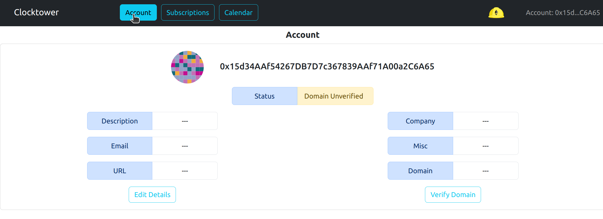
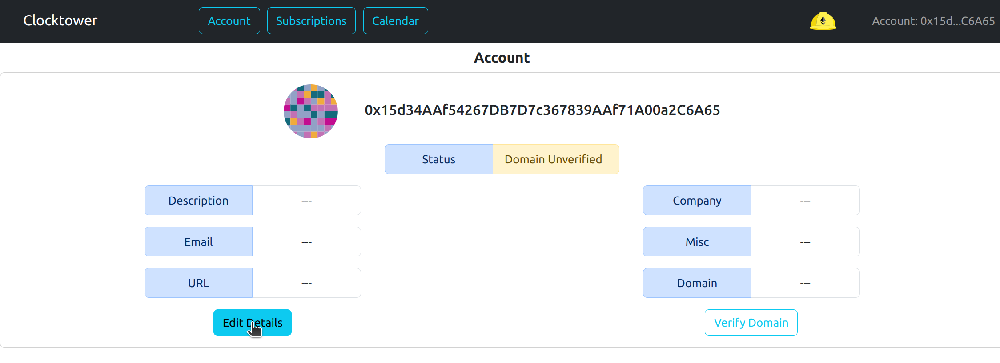
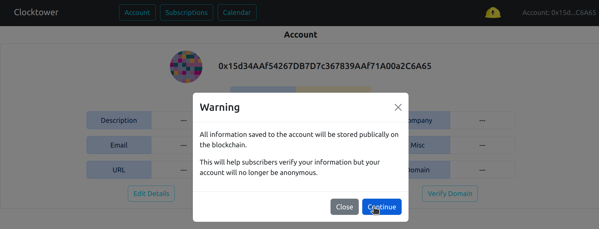
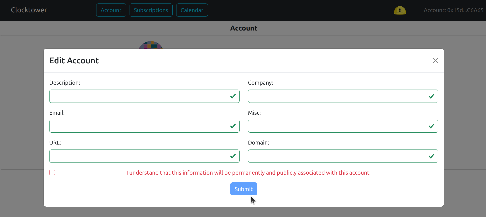
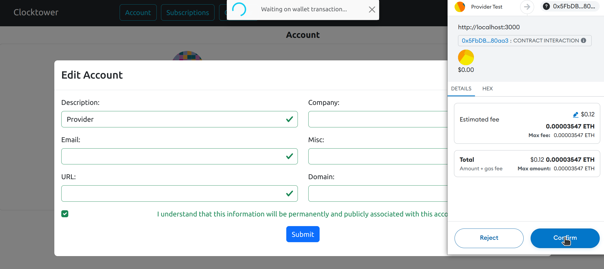
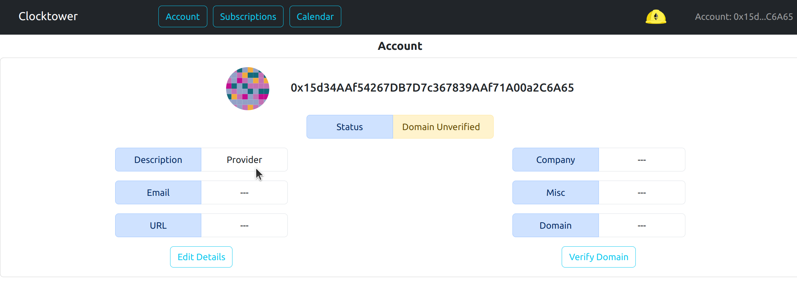

# Agregar / Editar detalles del proveedor

### Advertencia

Toda la información guardada en la cuenta se almacenará públicamente en la blockchain.

Esto ayudará a los suscriptores a verificar tu información, pero tu cuenta ya no será anónima.

### Parámetros Opcionales

| Parámetro | Descripción |
|---|---|
| Descripción | Descripción del proveedor |
| Empresa | Nombre de la empresa del proveedor |
| Email | Dirección de correo electrónico del proveedor |
| Misc | Campo misceláneo |
| URL | URL del proveedor |
| Dominio | Dominio del proveedor |

### Pasos para agregar detalles del proveedor

1. Haz clic en el botón "Cuenta" en el menú

2. Haz clic en el botón "Editar"

3. Ve la advertencia anterior y haz clic a través de la pantalla de advertencia

4. Agrega los detalles del Proveedor en los campos asegurándote de hacer clic en la casilla de verificación.

5. Completa la transacción

6. Los cambios deberían aparecer en tu cuenta

