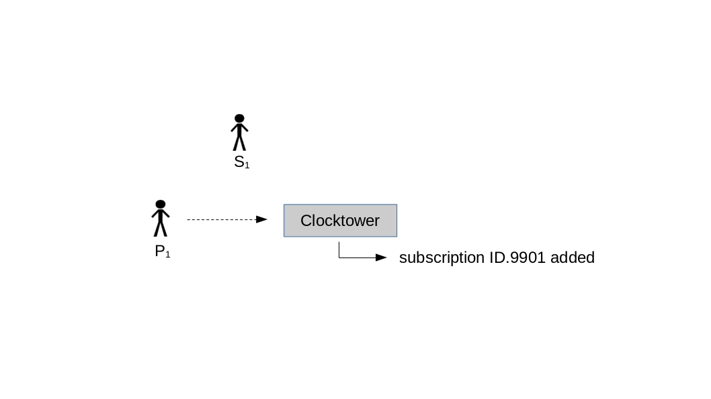
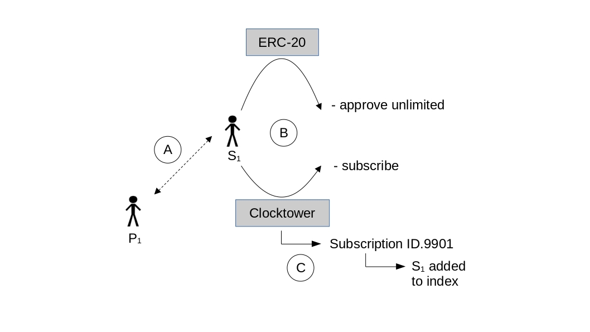
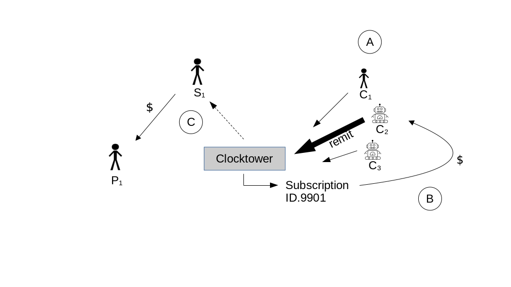

 
# Resumen

Clocktower es un protocolo descentralizado basado en la Máquina Virtual de Ethereum (EVM) para pagos recurrentes de tokens ERC-20. Clocktower permite que los pagos programados se procesen de manera confiable en el futuro *sin un procesador central*. El sistema emplea una serie de funciones que permiten a dos partes, un Suscriptor y un Proveedor, orquestar pagos recurrentes para un servicio o bien con la ayuda de una tercera parte, un agente de sondeo incentivado referido como el Llamador[^1]. Los casos de uso incluyen una variedad de posibilidades financieras y comerciales como hipotecas, alquiler, pagos de bonos, planificación patrimonial, suscripciones y muchos otros. Este documento técnico detallará los problemas resueltos por Clocktower y una visión general técnica del protocolo.
\
   
[^1]: Las tres categorías de usuarios reciben su nombre por sus funciones en un servicio de suscripción, aunque el protocolo tiene muchos casos de uso potenciales fuera de este modelo.

# Los Tres Problemas

Clocktower resuelve tres problemas:

#### Problema 1: Los Contratos EVM no son Conscientes del Tiempo

Los contratos inteligentes tienen limitaciones inherentes. Una de las más importantes para los pagos recurrentes es que los contratos inteligentes no son realmente conscientes del tiempo a menos que sean actuados por una cuenta de propiedad externa (EOA). El contrato es como una persona que lleva un reloj pero solo puede mirarlo cuando se le instruye hacerlo. Esta limitación hace que la programación automática sea inviable. Sin la capacidad de programar transacciones en el futuro, los servicios financieros comunes no son posibles en los sistemas descentralizados actuales.

#### Solución: Sondeo Incentivado

Clocktower emplea un mecanismo novedoso de sondeo incentivado para asegurar la ejecución adecuada de transacciones futuras. Un pago inicial contribuye a un saldo de tarifas almacenado en el contrato para la cuenta y esta tarifa se convierte en la recompensa continua para aquellos que instruyen al contrato para verificar el tiempo (es decir, los Llamadores), activados a través de la función _remit_ del contrato. La tarifa se establece en un porcentaje fijo y el Llamador recibe el pago en proporción al número de pagos realizados como compensación por el esfuerzo y los costos de gas por las transacciones.

Todos los pagos se realizan en especie para evitar la necesidad de oráculos, que es un objetivo general del protocolo [^2]. También se establece un mínimo de token por el contrato para que el Llamador pueda ser compensado por los costos de gas.

[^2]: Marx, H. (2024). Objetivos del protocolo Clocktower. https://clocktower.finance/docs/goals.


#### Problema 2: Sistemas Conflictuosos de Tiempo

Los humanos y las computadoras usan diferentes sistemas de tiempo. Las computadoras basadas en Unix usan un sistema llamado Tiempo de Época Unix, en el que un número se incrementa cada segundo desde el 1 de enero de 1970. Desafortunadamente, el mundo natural no se incrementa tan limpiamente--una revolución completa de la Tierra alrededor del sol es equivalente a 365.24 días y por eso cada 4 años, se agrega un día extra (es decir, día bisiesto) al calendario gregoriano moderno el 29 de febrero.

Además, los pagos recurrentes programados son una serie temporal de duración indefinida y no se puede guardar fácilmente una serie de duración indefinida con un número incrementándose. Por ejemplo, no hay una manera sensata de guardar la fecha "cada día 5 del mes" usando solo el tiempo unix. Teóricamente se podría guardar una larga serie de fechas calculadas en segundos después de la medianoche del 1 de enero de 1970. Pero esto es ineficiente ya que la serie necesitaría ser reiniciada si la suscripción dura más que la serie inicial de números.

#### Solución: Conversión en Tiempo Real

Una solución mucho más simple es usar un punto del calendario gregoriano convertido en tiempo real al tiempo de época unix en el contrato. La mejor manera de traducir el timestamp del bloque de época unix a rangos gregorianos es usar un estándar intermedio de días incrementándose llamado Días Julianos. Usando el siguiente código, el contrato Clocktower puede realizar esta traducción sin Oráculos o cualquier otra fuente externa [^3] [^4]. Como ejemplo:
\

[^3]: Bokkypoobah (2019). BokkyPooBahsDateTimeLibrary. https://github.com/bokkypoobah/BokkyPooBahsDateTimeLibrary.
[^4]: Navy, U.S. Conversión entre fechas julianas y fechas del calendario gregoriano. https://aa.usno.navy.mil/faq/JD_formula.

```
function unixToTime(uint unix) internal pure returns (Time memory time) {
       
    uint _days = unix/86400;
    uint16 day;
    uint16 yearDay;
       
    int __days = int(_days);

    int L = __days + 68569 + 2440588;
    int N = 4 * L / 146097;
    L = L - (146097 * N + 3) / 4;
    int _year = 4000 * (L + 1) / 1461001;
    L = L - 1461 * _year / 4 + 31;
    int _month = 80 * L / 2447;
    int _day = L - 2447 * _month / 80;
    L = _month / 11;
    _month = _month + 2 - 12 * L;
    _year = 100 * (N - 49) + _year + L;

    uint uintyear = uint(_year);
    uint month = uint(_month);
    uint uintday = uint(_day);

    day = uint16(uintday);       
    ...
```
\

#### Problema 3: Metodología de Tarifas

La pregunta más inmediata sobre la operación del sistema es: ¿quién paga las tarifas por el Llamador? Uno podría pensar inicialmente que el Proveedor debería pagar una porción de sus ganancias para este propósito. Esto parece más simple ya que solo hay un Proveedor y es quien recibe todos los fondos para una suscripción dada. Sin embargo, esto requeriría que el contrato tenga acceso a la cuenta del Proveedor y también crea vectores de ataque donde las tres partes podrían coludirse o podrían ser la misma entidad.

#### Solución: Prepago de Tarifas y Reembolso Dinámico

Una solución mucho mejor es que el Suscriptor prepague la cantidad cuando se suscriba. Esto garantiza que habrá fondos en la cuenta para pagar al Llamador incluso si el Suscriptor no tiene suficientes fondos o revoca la aprobación. Pero ¿qué sucede con estos tokens en la cuenta cuando ocurre un evento de reembolso? A través de codificar un mecanismo de reembolso dinámico en el contrato, podemos incentivar adecuadamente el comportamiento de reembolso. Esto se logra reembolsando a la parte que *no* se beneficiaría de la acción tomada (ver Tabla 1).
\

| Iniciador | Acción | Cantidad | Reembolsos Enviados a |
|---|---|---|---|
| Suscriptor | Falla debido a Aprobación | Parcial Llamador / Parcial Proveedor | Llamador / Proveedor |
|     |     |      |      |
| Suscriptor | Falla debido a fondos bajos | Parcial Llamador / Parcial Proveedor | Llamador / Proveedor |
|     |     |      |      |
| Suscriptor | Se desuscribe | Todo lo restante | Proveedor | 
|     |     |      |      |
| Proveedor | Proveedor desuscribe al suscriptor | Todo lo restante | Suscriptor |
|     |     |      |      |
| Proveedor | Cancela la suscripción general | Todo lo restante en todos los suscriptores | Suscriptores |
\begin{center}Tabla 1 - Reglas de Reembolso\end{center}
\

Por ejemplo, una suscripción dada puede ser terminada unilateralmente ya sea por el Suscriptor o el Proveedor. La regla general aquí es reembolsar cualquier fondo extra a la parte que no está cancelando. Esto elimina el potencial de que una parte se beneficie monetariamente de cancelar el servicio.

La prorrateo también es una consideración importante. Sin prorrateo, los Proveedores recibirían más de lo merecido por la mayoría de los pagos iniciales de los Suscriptores (es decir, cualquiera que no se registre exactamente el día de un nuevo ciclo). Como tal, el contrato hace un cálculo de prorrateo con cada nuevo registro:
\

~~~
function prorate(uint unixTime, uint40 dueDay, uint fee, uint8 frequency) internal pure returns (uint)  {
    Time memory time = unixToTime(unixTime);
    uint currentDay;
    uint max;
    uint lastDayOfMonth;
    
    //establece la cantidad máxima de días del rango

    ...
    //mensual
    } else if (frequency == 1){
        //calcula los días máximos en el mes actual
        lastDayOfMonth = getDaysInMonth(time.year, time.month);
        currentDay = time.dayOfMonth;
        max = lastDayOfMonth;

    ...
    //mensual
    if(frequency == 1) {
        uint dailyFee = (fee * 12 / 365);
        if(dueDay != currentDay && currentDay > dueDay){
                //las fechas dividen meses
                fee = (dailyFee * (max - (currentDay - dueDay)));
        } else if (dueDay != currentDay && currentDay < dueDay) {
                //ambas fechas están en el mismo mes
                fee = (dailyFee * (dueDay - currentDay));
        }
    }

    ...
    return fee;
}

    ...

    if(subscription.frequency == Frequency.MONTHLY || subscription.frequency == Frequency.WEEKLY){
            fee = prorate(block.timestamp, subscription.dueDay, fee, uint8(subscription.frequency));
        } 
    ...
~~~


# Ciclo de Vida: Los Tres Usuarios

Esta sección explora los actores principales y el ciclo de vida del protocolo, que puede ser modelado como un proceso de tres fases: creación, iniciación e incrementación.

{ width=75% }

#### Creación
En la fase de creación (ver Figura 1) un Proveedor configura una suscripción que le gustaría proporcionar en un intervalo fijo (semanal, mensual, anual, etc.). Esto puede hacerse a través de interacción directa con el contrato o, en la mayoría de los casos, a través de un sitio web que proporcione una interfaz de usuario simple. Independientemente, este proceso involucra a un Proveedor haciendo una llamada de función al contrato Clocktower, especificando parámetros de la suscripción incluyendo la cantidad del pago, token(s) ERC20 aceptados, descripción/detalles de la suscripción para ser emitidos en logs, el intervalo de pago, y la fecha de vencimiento del pago.
\
```
function createSubscription(uint amount, address token, Details calldata details, Frequency frequency, uint16 dueDay) 
    external payable {
    ...
```
\
Se genera entonces un ID de suscripción y se agrega al índice de suscripciones del contrato. Una suscripción también puede ser destruida a través de funciones relacionadas del contrato llamadas por el mismo Proveedor.
\ 


{ width=75% }


#### Iniciación
Después de que el Proveedor crea la suscripción, ahora está disponible para cualquiera que quiera configurar pagos recurrentes (ver Figura 2). Fuera de la cadena, el Proveedor anuncia el servicio a potenciales Suscriptores que pueden registrarse vía enlace (A). Nuevamente, ya sea a través de interacción directa con el contrato vía scripts o más probablemente, un portal web, un potencial Suscriptor hará dos transacciones (B). La primera llama a la función _approve_ al contrato ERC-20 apropiado, lo que permite al contrato hacer futuros retiros del token de la EOA especificada. La siguiente transacción llamará a _subscribe_, que toma los parámetros de la estructura Subscription. El contrato entonces hace una serie de verificaciones de validación, más importante que haya una asignación adecuada y que haya suficiente del token para cubrir la cantidad de la suscripción. Si es válida, el Suscriptor es agregado al índice del contrato (C) para la EOA y se hace el primer pago para llenar el saldo de tarifas. Un cálculo de prorrateo asegura que el Suscriptor no pague de más basado en el día del ciclo en que comienza su suscripción.
\

{ width=75% }


#### Incrementación
Después de que las transacciones iniciales han ocurrido, no hay más requisitos en el Suscriptor, aparte de mantener su saldo de EOA suficiente para cubrir los costos de los pagos recurrentes. Un agente de sondeo incentivado conocido como Llamador, es clave para la extensión de pagos recurrentes hacia el futuro. El rol del Llamador es simple: llamar a una sola función, _remit_, en el contrato Clocktower (A). Este es el mecanismo a través del cual el contrato se vuelve 'consciente del tiempo'. _remit_ calcula el día actual (la unidad más atómica de un pago recurrente en Clocktower_V1) y confirma que el índice de suscripciones del contrato no ha sido verificado aún en este día. Si ya ha sido verificado, la función termina y se devuelve un código de error. Si el índice no ha sido verificado aún, el contrato recorre todas las suscripciones para ver si algún pago está vencido. Aquellos pagos que están vencidos y tienen saldos de tarifas suficientes, son remitidos al Proveedor apropiado (C) y la tarifa es pagada al Llamador (B).

Hay algunas otras partes importantes de la función _remit_. Primero, en casos donde un Suscriptor no tiene un saldo de tarifas suficiente para cubrir la tarifa completa por el pago recurrente, el contrato realiza una transacción especial donde rellena el saldo de tarifas, tal como lo hizo cuando el Suscriptor se registró por primera vez para el servicio, en la fase de Iniciación. Este relleno de tarifas necesitará ocurrir regularmente durante la vida del pago recurrente, dependiendo de la frecuencia de la suscripción. Importante, en el evento de que el saldo de un Suscriptor haya caído por debajo del nivel de la cantidad del pago recurrente pero aún puede cubrir la tarifa y/o el saldo de tarifas, el contrato continuará realizando estas acciones--esto asegura que el Llamador no sea penalizado por Suscriptores con saldos bajos.

Si el saldo de un Suscriptor entonces cae por debajo del nivel de la tarifa de suscripción, _remit_ entra en modo de falla. El Suscriptor es removido automáticamente de la lista de suscripciones y el resto de la tarifa es enviado al Proveedor de la suscripción.
\

## Conclusión
En los últimos años, las finanzas descentralizadas se han desarrollado rápidamente. Los protocolos de préstamos y exchanges descentralizados se han convertido en primitivas esenciales, pero un sistema de programación de pagos futuros ha estado ausente. Clocktower es esta pieza faltante de DeFi, permitiendo que el servicio de deuda, suscripciones, y otros pagos recurrentes sean automatizados en redes EVM.
\


